# Manuscript Compiler 

## Saved Compilations

A **Saved Compilation** stores a reusable compilation setup for a manuscript, not a copy of its prose. Choose **New compilation** to start fresh, or select a Saved Compilation to continue a setup for the selected manuscript folder.

Use **Save changes** to update the current saved setup. Use **Save as…** to create another saved setup from the current choices. When the manuscript changes, use **Contents** and **Correct structure** to review each item’s role, inclusion, and order. If a manuscript folder moves, use **Locate manuscript…** and then Save changes to keep the new association.

The workspace shows **Unsaved changes** for saved setup edits.

Use **Manage…** to browse saved compilations for the current manuscript. **Rename** changes only a saved compilation’s display name. **Duplicate** copies its persisted setup without switching to the copy. **Delete** removes only the saved setup—it never deletes manuscript or exported files. Deleting the current saved compilation keeps the usable workspace as a **New compilation**; use **Save as…** if you want to save it again.

[](https://github.com/anthonyfitzpatrick/manuscript-compiler/releases/latest)
[](LICENSE)
[](https://obsidian.md/)
[](https://www.typescriptlang.org/)
[](https://github.com/anthonyfitzpatrick/manuscript-compiler/actions/workflows/ci.yml)
[](https://github.com/anthonyfitzpatrick/manuscript-compiler/releases)
<a href="https://buymeacoffee.com/wolf359pressab"></a>

Compile structured Obsidian manuscripts into publication-ready DOCX, ODT, EPUB, HTML, Markdown, and XML files for Vellum and other publishing workflows.

<p align="center">
  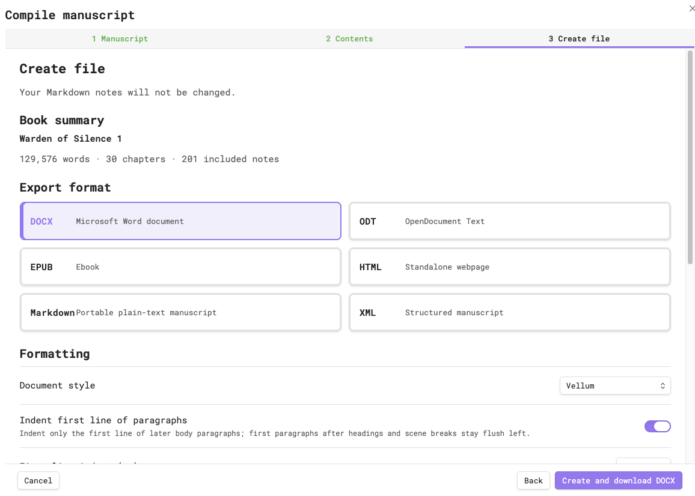
</p>

*The final Create file stage: a reviewed 129,576-word novel, ready to compile into any of six native publishing formats.*

Manuscript Compiler guides the book through **Manuscript → Contents → Create file**. By the time this screen appears, the selected notes have been scanned, their publishing roles and order have been reviewed, and one semantic Book has been prepared for every format. Choose the output and formatting you need, then create the file locally—without rewriting the Markdown manuscript. The workspace stays open after each file so you can inspect it, adjust settings, create another format, or save the compilation when ready.

When you create a file from a **New compilation**, choose **Save and create** to name and retain the setup, or **Create without saving** to export it only. A dirty Saved Compilation similarly offers **Save changes and create** or **Create without saving**. Clean Saved Compilations create files directly.

## Save a setup, then create a file

**Save changes** and **Save as…** save a Saved Compilation configuration: the selected manuscript, reviewed Contents choices, and output settings. They do not create a manuscript file.

On **Create file**, choose a format and filename, then select **Create and download _format_**. Manuscript Compiler generates and validates the file in memory, then starts Obsidian’s/browser host download or share flow. The host may ask for a destination, save to its configured Downloads location, or offer sharing; Manuscript Compiler does not present its own destination picker and never writes output into the vault. Cancelling the setup-save prompt creates nothing; dismissing a host save/share flow leaves no confirmed output file.

## Why Manuscript Compiler?

Manuscript Compiler understands a book as **Parts, Chapters, Scenes, Front Matter, and Back Matter**—not merely as a collection of Markdown files. It detects that publishing structure, lets you review and correct inclusion, roles, and order, then compiles only the manuscript you approved.

Designed specifically for long-form authors, it keeps research, dashboards, development notes, and excluded drafts out of the finished book while preserving the hierarchy expected by editing and publishing tools. Your source notes are never rewritten.

For a file designated as a **Scene**, its structural title is used for organisation and navigation, not emitted as manuscript body text. Headings written later in the Scene body remain in the export.

## Features

### Author Workflow

- Right-click any manuscript folder
- Automatic structure detection
- Manual correction before export
- Semantic review of the complete book
- One-click compilation and download

### Publishing

- Native DOCX
- Native ODT
- Native EPUB 3
- Native offline HTML
- Native Markdown
- Native semantic XML
- DOCX designed for Vellum workflows

### Privacy

- Fully offline compilation and export
- No telemetry or analytics
- No cloud service or account
- No manuscript network access
- No external executables
- No companion plugins
- No changes to manuscript notes

### Reliability

- One shared semantic `Book` model for every format
- Format-specific structural validation before download
- Deterministic structural output
- Stale-preview protection
- Comprehensive automated tests

## Quick Start

1. [Install the plugin](#installation).
2. Right-click the complete manuscript folder in Obsidian.
3. Review and correct the detected structure.
4. Choose an export format and formatting preset.
5. Select **Create and download _format_**, then complete the host download or share flow.

See the [User Guide](USER_GUIDE.md) for the complete author workflow.

## Export Formats

| Format | Purpose |
| --- | --- |
| **DOCX** | Word editing, submission, and Vellum import workflows |
| **ODT** | LibreOffice and other OpenDocument workflows |
| **EPUB** | Reflowable EPUB 3 proofing and ebook workflows |
| **HTML** | A self-contained offline browser proof with embedded CSS |
| **Markdown** | Portable, readable plain-text manuscripts |
| **XML** | Presentation-neutral semantic interchange and automation |

## Capability Comparison

| Capability | Manuscript Compiler |
| --- | :---: |
| Native DOCX | ✅ |
| Native ODT | ✅ |
| Native EPUB | ✅ |
| Offline operation | ✅ |
| No Pandoc | ✅ |
| No companion plugin | ✅ |
| No telemetry | ✅ |
| Open source | ✅ |

## Screenshots

### Plugin Settings

<p align="center">
  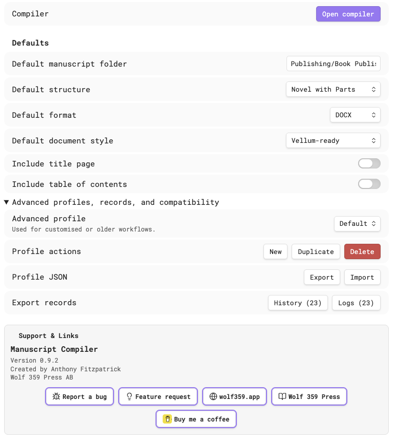
</p>

*Set author defaults once, then open the compiler directly from Obsidian settings.*

### Right-click Menu

<p align="center">
  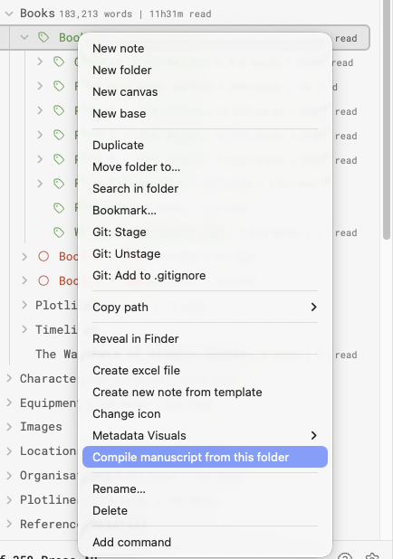
</p>

*Start from the exact folder that contains the complete book.*

### Manuscript Screen

<p align="center">
  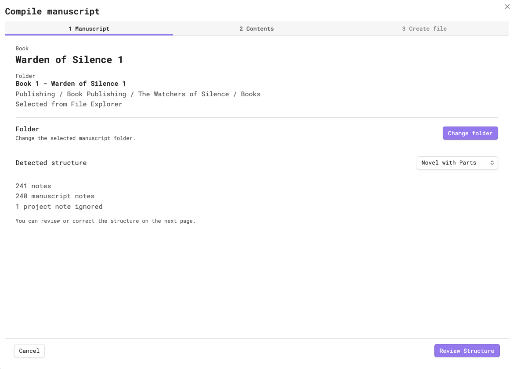
</p>

*Confirm the manuscript root and automatically detected book structure.*

### Contents Review

<p align="center">
  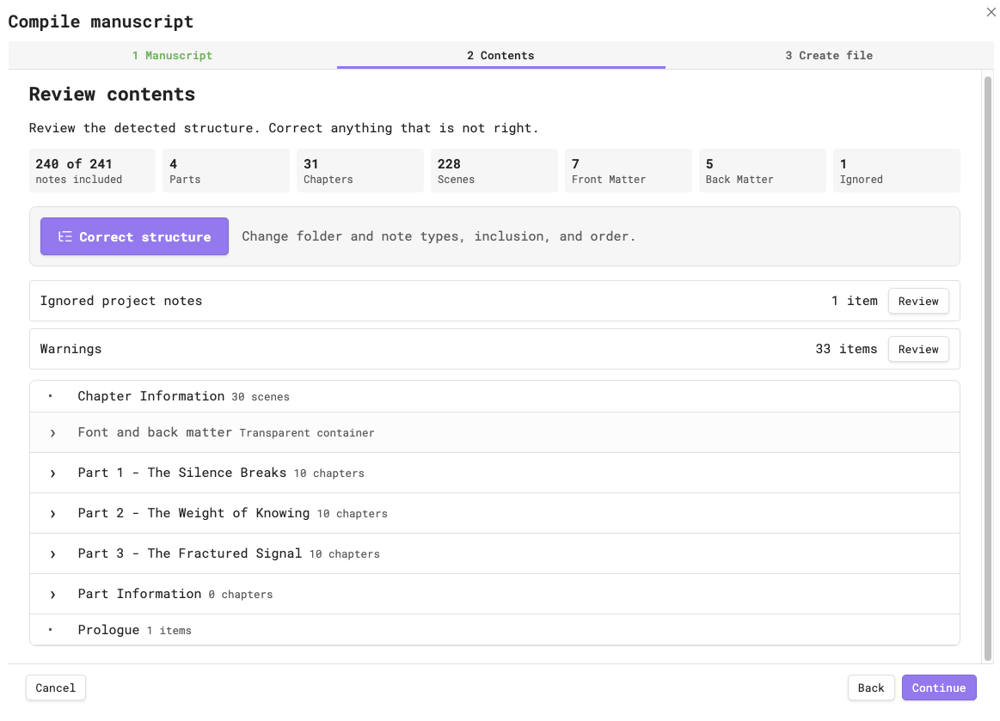
</p>

*Review Parts, Chapters, Scenes, matter, warnings, and ignored notes before export.*

### Correct Structure

<p align="center">
  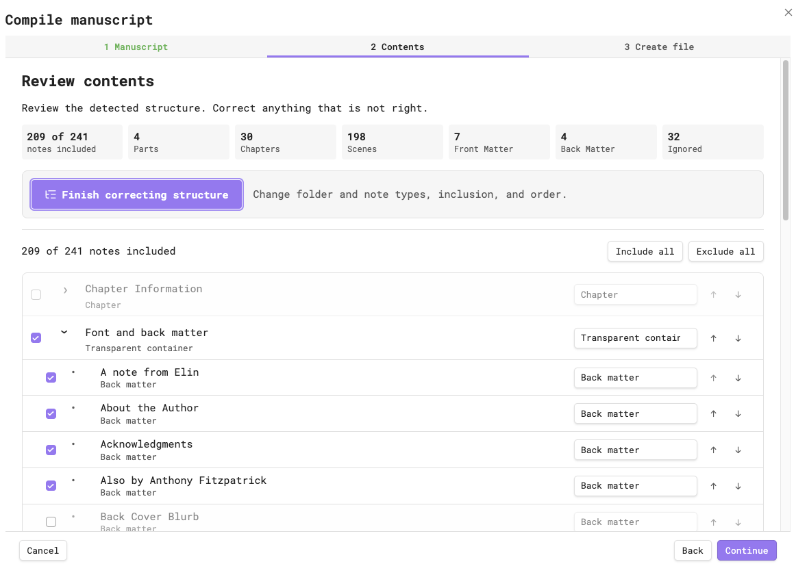
</p>

*Correct inclusion, publishing roles, and order without moving or rewriting source notes.*

### Create file

<p align="center">
  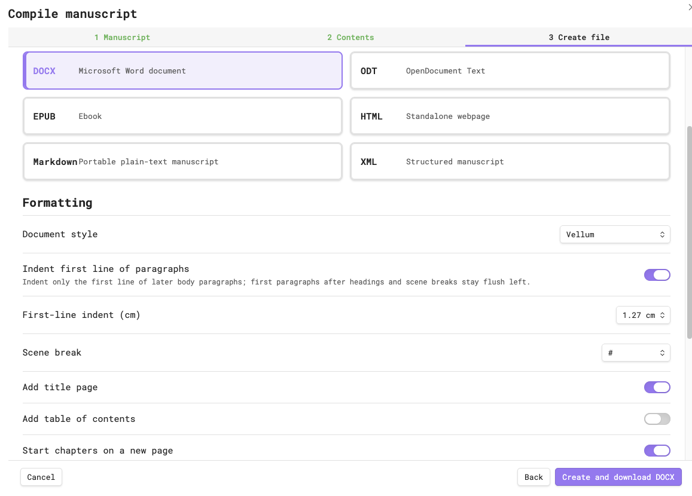
</p>

*Choose the output format and meaningful publishing controls, then create the file.*

### DOCX in Microsoft Word

<p align="center">
  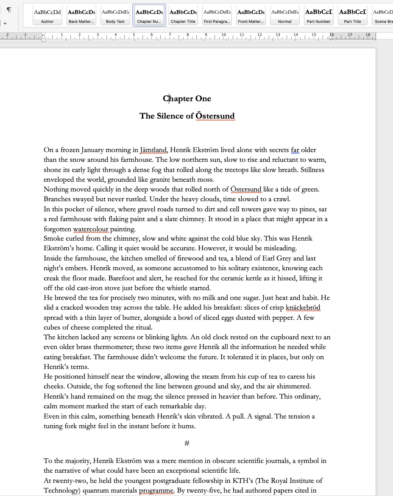
</p>

*Native DOCX opens with distinct structural formatting and named manuscript styles.*

### DOCX in Vellum

<p align="center">
  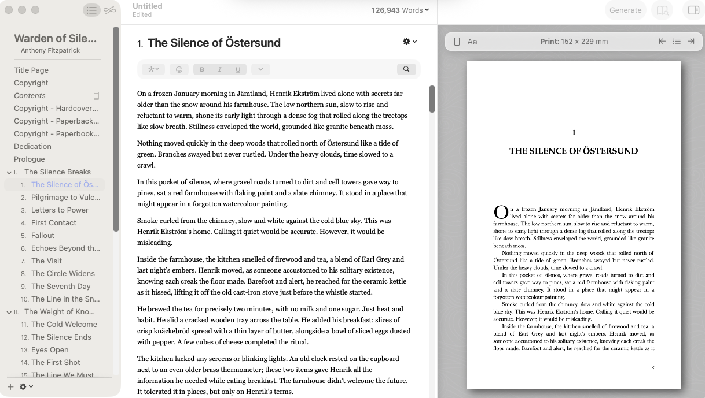
</p>

*Vellum recognises the compiled Part and Chapter hierarchy.*

### ODT in LibreOffice

<p align="center">
  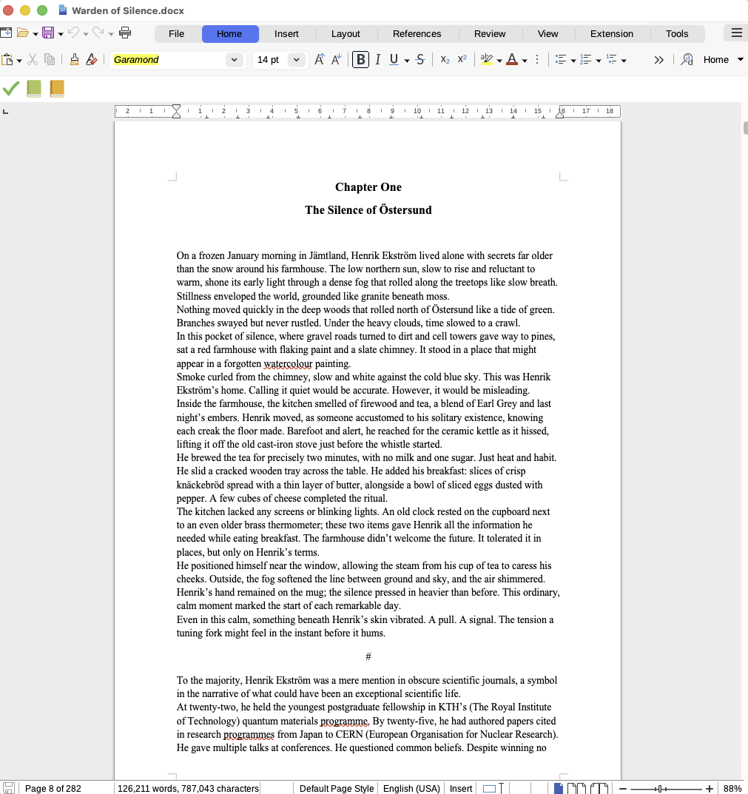
</p>

*Native ODT carries the manuscript structure into LibreOffice Writer.*

### EPUB Reader

<p align="center">
  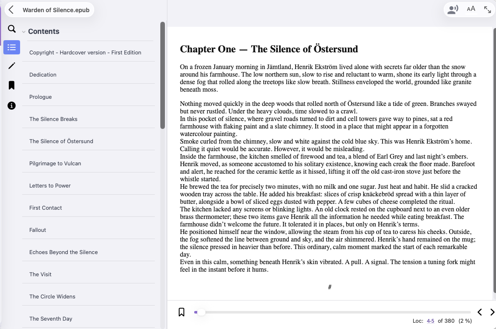
</p>

*The EPUB provides navigable contents and a reflowable reading view.*

## Documentation

- [User Guide](USER_GUIDE.md)
- [Developer Guide](DEVELOPER_GUIDE.md)
- [Architecture](ARCHITECTURE.md)
- [Security Policy](SECURITY.md)
- [Contributing](CONTRIBUTING.md)
- [Manual Release Checklist](MANUAL_TESTING.md)

## Installation

### Community Plugins

Search the [Obsidian Community Plugins directory](https://community.obsidian.md/plugins/manuscript-compiler) for **Manuscript Compiler**, then select **Install** and **Enable**.

### Manual Installation

Download `main.js`, `manifest.json`, and `styles.css` from the same [GitHub release](https://github.com/anthonyfitzpatrick/manuscript-compiler/releases). Place them directly in `<vault>/.obsidian/plugins/manuscript-compiler/`, reload Obsidian, and enable **Manuscript Compiler** under Community Plugins.

## Known Limitations

- Complex tables, embedded media, and advanced Markdown layouts are outside the semantic fiction model.
- Save and share behaviour depends on the desktop or mobile host.
- EPUB and target-application validation still require representative reader testing.
- Unusual authoring templates may require manual structure correction.
- Manuscript Compiler is not a fixed-page desktop-publishing engine.

See [Known limitations in the User Guide](USER_GUIDE.md#known-limitations) for details and recommended testing.

## Development and Validation

```bash
npm ci
npm run typecheck
npm run lint
npm test
npm run test:docx
npm run test:odt
npm run test:epub
npm run test:html
npm run test:markdown
npm run test:xml
npm run test:exports
npm run benchmark:large
npm run build
npm run package
npm run package:validate
npm audit
git diff --check
```

The release archive is `release/manuscript-compiler-<version>.zip` and contains exactly `main.js`, `manifest.json`, and `styles.css`. The editable `logo.svg` remains in the repository for README, GitHub, documentation, website, and social branding; its artwork is compiled into `main.js` and it is not a runtime or release-package file.

Automated structural validation is not a substitute for opening outputs in Word, Vellum, LibreOffice, multiple EPUB readers, text editors, and browsers. See the [Manual Release Checklist](MANUAL_TESTING.md).

## Licence

[MIT](LICENSE)
