# Manuscript Compiler User Guide

## Introduction

Manuscript Compiler turns an author-reviewed set of Markdown notes into DOCX, ODT, EPUB, HTML, Markdown, or XML. It runs inside Obsidian, works offline, and never changes manuscript notes. Exported files are created in memory and handed to the operating system's download or share flow; manuscript exports are not written into the vault.

The workflow has three stages:

1. **Manuscript** — choose the exact book folder and its broad structure.
2. **Contents** — review what will be included and correct roles or order when necessary.
3. **Create file** — choose a format, formatting, filename, and start the download.

<!-- SCREENSHOT:01 -->

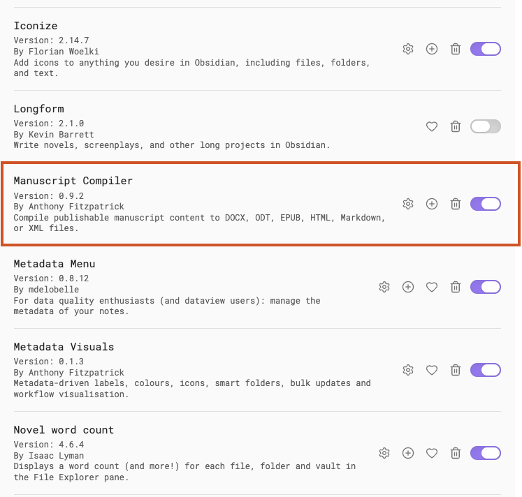

*Manuscript Compiler installed and enabled in Obsidian’s Community plugins settings.*

---

## Installation

Until Manuscript Compiler is available through Obsidian's Community Plugins catalogue:

1. Download `main.js`, `manifest.json`, and `styles.css` from a release whose tag exactly matches the manifest version.
2. Create `<vault>/.obsidian/plugins/manuscript-compiler/` if it does not exist.
3. Put only those three files in that folder.
4. Restart Obsidian or reload community plugins.
5. Open **Settings → Community plugins** and enable **Manuscript Compiler**.

The plugin is mobile-safe, but the exact save/share experience depends on the mobile operating system and Obsidian host.

## Updating

1. Close any open Manuscript Compiler window.
2. Back up the vault using the same process used for other important Obsidian data.
3. Replace `main.js`, `manifest.json`, and `styles.css` with all three files from the same release.
4. Restart Obsidian.
5. Open the plugin once and confirm existing profiles and formatting choices remain available.

Never mix files from different release versions. Settings migration is designed to preserve older choices, but downgrading is not a supported migration path.

## Creating a manuscript

### Recommended folder structure

The compiler works best when the selected folder represents exactly one book. A conventional novel might look like this:

```text
Book title/
├── Ebook Front Matter/
│   ├── Copyright.md
│   └── Dedication.md
├── Manuscript/
│   ├── Part 1 - Departure/
│   │   ├── Chapter 1 - Leaving/
│   │   │   ├── Scene 1.md
│   │   │   └── Scene 2.md
│   │   └── Chapter 2 - Crossing/
│   └── Part 2 - Return/
├── Ebook Back Matter/
│   └── About the Author.md
├── Development/
└── Research/
```

`Manuscript`, `Draft`, `Drafts`, `Book`, `Content`, and `Chapters` can act as transparent containers. A transparent container organises the vault but does not create a heading in the exported book. Common project folders—such as Development, Research, Archive, Dashboards, Templates, and Exports—are ignored by default and remain visible for review.

### Right-click workflow

In File Explorer, right-click the exact book folder and choose **Compile manuscript from this folder**. The clicked folder becomes the authoritative root; it is not exported as a Part or Chapter.

<!-- SCREENSHOT:02 -->

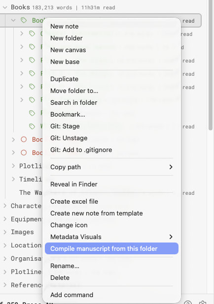

*Right-click a book folder and choose **Compile manuscript from this folder** to use it as the manuscript root.*

---

You can also open Manuscript Compiler from the command palette or plugin settings. When those routes do not already identify a folder, choose one on the Manuscript screen.

<!-- SCREENSHOT:03 -->

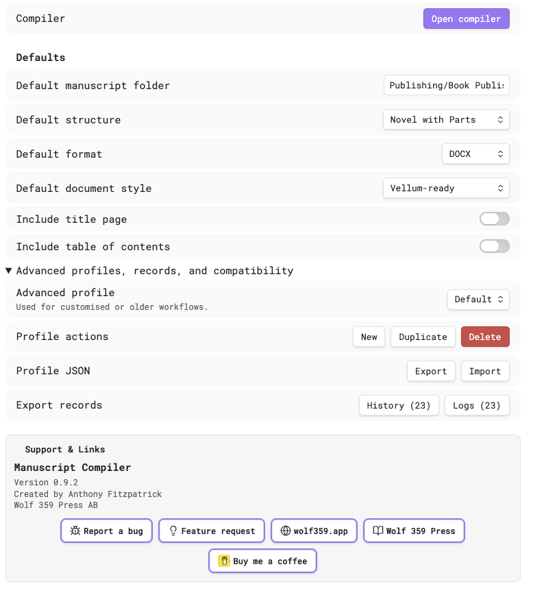

*The Manuscript Compiler settings tab provides an **Open compiler** button alongside defaults, advanced profile tools, and support links.*

---

## The Manuscript screen

Confirm the selected folder and choose the structure preset closest to the project. The preset controls initial detection only; Contents corrections remain authoritative.

<!-- SCREENSHOT:04 -->

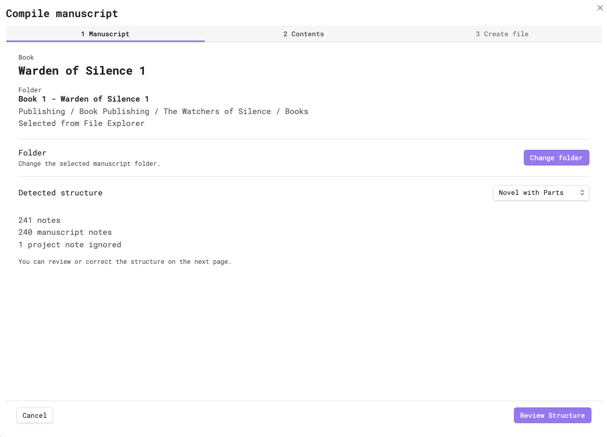

*The Manuscript stage confirms the selected book folder and detected structure before you choose **Review Structure**.*

---

<!-- SCREENSHOT:05 -->

You only need the folder chooser when you want to change the selected folder or when you opened Manuscript Compiler without using **Compile manuscript from this folder** in the File Explorer right-click menu.

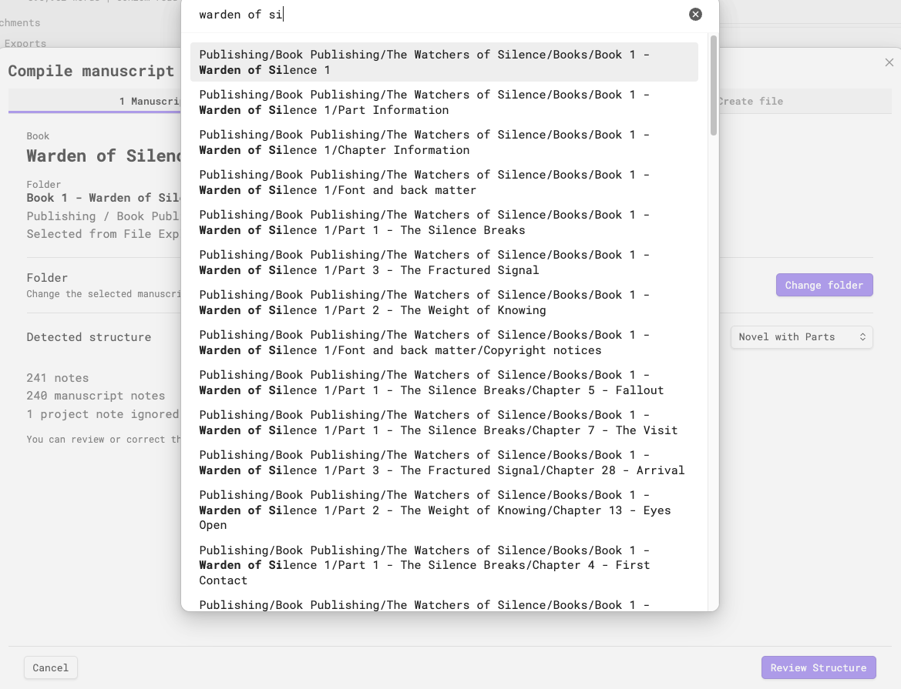

*Search for and select the folder that represents the complete book. The chosen folder becomes the manuscript root.*

---

### Structure presets

- **Novel with Parts** — Part folders contain Chapter folders, which contain Scene notes.
- **Novel** — Chapter folders contain Scene notes; no Parts are required.
- **Chapter notes** — each Chapter is a note rather than a folder of Scenes.
- **Short story** — one or more manuscript notes without a Part/Chapter hierarchy.
- **Anthology** — collections and story notes are treated as a multi-work structure.
- **Custom** — retains advanced profile rules and is intended for established non-standard layouts.

Choose the nearest preset and correct exceptions on Contents. Renaming the vault is not required merely to satisfy a preset.

<!-- SCREENSHOT:06 -->

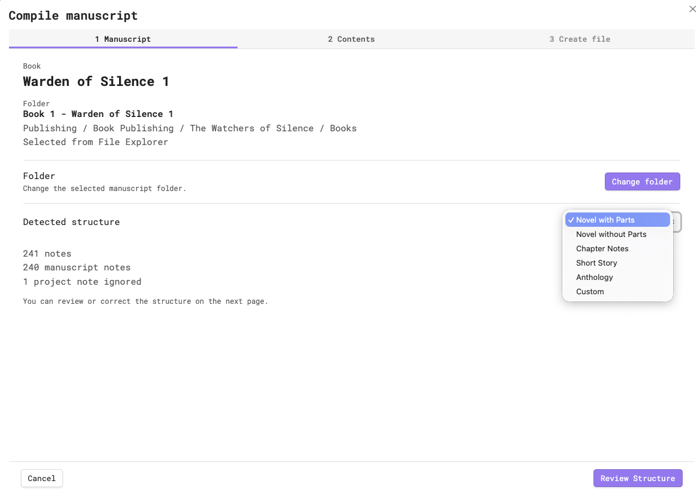

*Choose the preset that most closely matches the book. **Novel with Parts** is selected here before reviewing the detected structure.*

---

## Reviewing Contents

Contents opens as a compact review, not an editing form. Summary cards show detected manuscript counts, and the outline shows included structure. Ignored material and warnings have focused review filters.

<!-- SCREENSHOT:07 -->

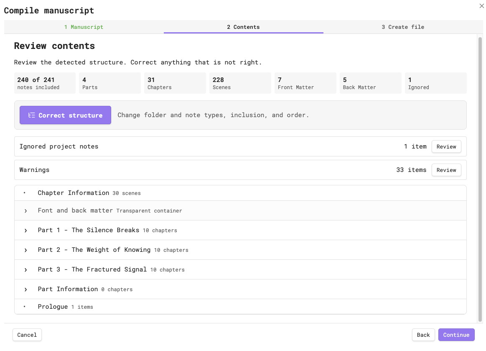

*Review the detected counts, ignored items, warnings, and manuscript outline before continuing or choosing **Correct structure**.*

---

### Understanding ignored notes

Ignored notes are not deleted or changed. They are excluded from the prepared Book because their folder or content resembles project material, dashboards, notes, revisions, research, templates, or old exports. Review the ignored filter when a manuscript note is missing. If detection is wrong, use correction mode to include it and assign the appropriate role.

### Correcting structure

Choose **Correct structure** to reveal inclusion toggles, type selectors, disclosure controls, and Move up/down actions. The button changes to **Finish correcting structure** while correction mode is active.

Available roles are Front matter, Transparent container, Part, Chapter, Scene, Back matter, and Exclude. Correct a folder role before correcting many descendants; front/back matter inheritance updates untouched children while preserving explicit overrides.

Keyboard users can Tab to controls, use Space/Enter on buttons and toggles, and use the format radio group's arrow keys later on Create file. Focus remains visible.

<!-- SCREENSHOT:08 -->

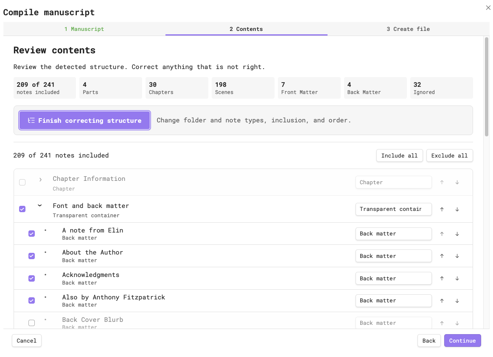

*In correction mode, use the checkboxes, role selectors, disclosure controls, and arrows to change inclusion, structure, and order.*

---

<!-- SCREENSHOT:09 -->

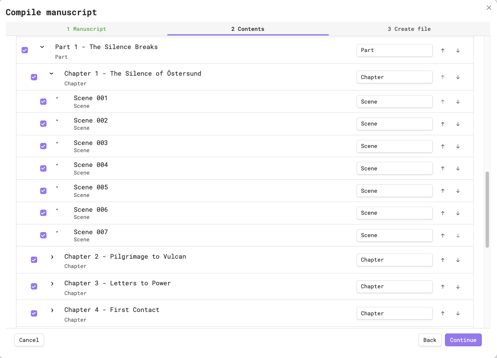

*Collapse large branches to simplify structure review. Descendant inclusion, roles, and ordering remain saved while a branch is collapsed.*

---

<!-- SCREENSHOT:10 -->

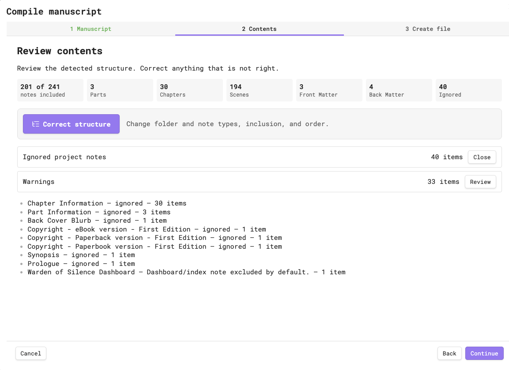

*Open **Ignored project notes** to review excluded material and the reason each item was left out of the prepared book.*

---

<!-- SCREENSHOT:11 -->

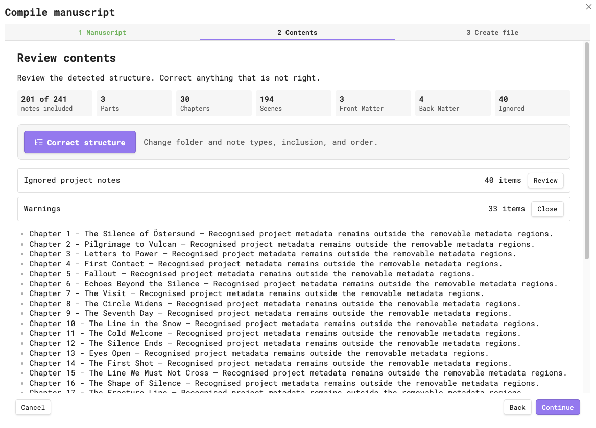

*Open **Warnings** to review structural concerns and their explanations before continuing to Create file.*

---

When finished, choose **Finish correcting structure** and continue to Create file. The prepared preview is invalidated whenever inclusion, roles, order, cleaning inputs, or semantic formatting changes.

## Create file

Create file shows the prepared Book summary, six format cards, relevant formatting controls, warnings, resolved filename, and the primary create/download action. Switching only the format or filename reuses the same prepared Book. A source-note or semantic-choice change requires **Refresh preview**.

<!-- SCREENSHOT:12 -->

<p style="color:#cc0000; font-size:1.5em; font-weight:bold; margin-bottom:0;">
📸 SCREENSHOT REQUIRED — #12
</p>

<p style="color:#cc0000; font-weight:bold;">
CAPTURE
</p>

<p style="color:#cc0000;">
Capture the format-selection area at the top of Create file before opening Advanced formatting.
</p>

<p style="color:#cc0000; font-weight:bold;">
SHOW
</p>

<ul style="color:#cc0000;">
<li>All six format cards: DOCX, ODT, EPUB, HTML, Markdown, and XML</li>
<li>One clearly selected card</li>
<li>The selected card's visible focus or selection treatment</li>
<li>The prepared Book summary above the selector</li>
<li>The filename extension corresponding to the selected format</li>
</ul>

<p style="color:#cc0000; font-weight:bold;">
PURPOSE
</p>

<p style="color:#cc0000;">
Introduces the six export choices and shows that changing format updates the filename while retaining the same prepared Book.
</p>

<p style="color:#cc0000; font-weight:bold;">
WHEN REPLACING
</p>

<p style="color:#cc0000;">
Delete this entire placeholder and replace it with the final screenshot and caption.
</p>

---

### Format selector

Click a card or focus the selected card and use Left/Right or Up/Down arrows. Home selects DOCX and End selects XML. Changing formats corrects the filename extension automatically.

<!-- SCREENSHOT:13 -->

<p style="color:#cc0000; font-size:1.5em; font-weight:bold; margin-bottom:0;">
📸 SCREENSHOT REQUIRED — #13
</p>

<p style="color:#cc0000; font-weight:bold;">
CAPTURE
</p>

<p style="color:#cc0000;">
Select DOCX on Create file and capture the selected card together with the controls and action that change for DOCX.
</p>

<p style="color:#cc0000; font-weight:bold;">
SHOW
</p>

<ul style="color:#cc0000;">
<li>The DOCX card in its obvious selected state</li>
<li>The “Editable word-processing document” description</li>
<li>The resolved filename ending in `.docx`</li>
<li>The “Create and download DOCX” primary button</li>
<li>The beginning of the DOCX formatting controls</li>
</ul>

<p style="color:#cc0000; font-weight:bold;">
PURPOSE
</p>

<p style="color:#cc0000;">
Shows how the selected format controls the filename, available formatting options, and final download action.
</p>

<p style="color:#cc0000; font-weight:bold;">
WHEN REPLACING
</p>

<p style="color:#cc0000;">
Delete this entire placeholder and replace it with the final screenshot and caption.
</p>

---

<!-- SCREENSHOT:14 -->

<p style="color:#cc0000; font-size:1.5em; font-weight:bold; margin-bottom:0;">
📸 SCREENSHOT REQUIRED — #14
</p>

<p style="color:#cc0000; font-weight:bold;">
CAPTURE
</p>

<p style="color:#cc0000;">
Select ODT on Create file and capture the selected card together with the ODT filename and primary action.
</p>

<p style="color:#cc0000; font-weight:bold;">
SHOW
</p>

<ul style="color:#cc0000;">
<li>The ODT card in its obvious selected state</li>
<li>The format description</li>
<li>The resolved filename ending in `.odt`</li>
<li>The “Create and download ODT” primary button</li>
<li>First-line indentation controls available for ODT</li>
</ul>

<p style="color:#cc0000; font-weight:bold;">
PURPOSE
</p>

<p style="color:#cc0000;">
Identifies ODT as the editable OpenDocument choice and demonstrates its format-specific selection state.
</p>

<p style="color:#cc0000; font-weight:bold;">
WHEN REPLACING
</p>

<p style="color:#cc0000;">
Delete this entire placeholder and replace it with the final screenshot and caption.
</p>

---

<!-- SCREENSHOT:15 -->

<p style="color:#cc0000; font-size:1.5em; font-weight:bold; margin-bottom:0;">
📸 SCREENSHOT REQUIRED — #15
</p>

<p style="color:#cc0000; font-weight:bold;">
CAPTURE
</p>

<p style="color:#cc0000;">
Select EPUB on Create file and capture the selected card together with its reflowable-book controls and action.
</p>

<p style="color:#cc0000; font-weight:bold;">
SHOW
</p>

<ul style="color:#cc0000;">
<li>The EPUB card in its obvious selected state</li>
<li>The reflowable ebook description</li>
<li>The resolved filename ending in `.epub`</li>
<li>The “Create and download EPUB” primary button</li>
<li>The title-page and table-of-contents choices where visible</li>
</ul>

<p style="color:#cc0000; font-weight:bold;">
PURPOSE
</p>

<p style="color:#cc0000;">
Shows the EPUB choice and the controls relevant to a reflowable ebook package.
</p>

<p style="color:#cc0000; font-weight:bold;">
WHEN REPLACING
</p>

<p style="color:#cc0000;">
Delete this entire placeholder and replace it with the final screenshot and caption.
</p>

---

<!-- SCREENSHOT:16 -->

<p style="color:#cc0000; font-size:1.5em; font-weight:bold; margin-bottom:0;">
📸 SCREENSHOT REQUIRED — #16
</p>

<p style="color:#cc0000; font-weight:bold;">
CAPTURE
</p>

<p style="color:#cc0000;">
Select HTML on Create file using keyboard navigation and capture the selected card with a visible focus ring.
</p>

<p style="color:#cc0000; font-weight:bold;">
SHOW
</p>

<ul style="color:#cc0000;">
<li>The HTML card selected</li>
<li>A visible keyboard focus ring distinct from the selected state</li>
<li>The web-readable format description</li>
<li>The resolved filename ending in `.html`</li>
<li>The “Create and download HTML” primary button</li>
</ul>

<p style="color:#cc0000; font-weight:bold;">
PURPOSE
</p>

<p style="color:#cc0000;">
Demonstrates HTML selection, automatic extension changes, and keyboard-accessible format navigation.
</p>

<p style="color:#cc0000; font-weight:bold;">
WHEN REPLACING
</p>

<p style="color:#cc0000;">
Delete this entire placeholder and replace it with the final screenshot and caption.
</p>

---

<!-- SCREENSHOT:17 -->

<p style="color:#cc0000; font-size:1.5em; font-weight:bold; margin-bottom:0;">
📸 SCREENSHOT REQUIRED — #17
</p>

<p style="color:#cc0000; font-weight:bold;">
CAPTURE
</p>

<p style="color:#cc0000;">
Select Markdown on Create file and capture its selected card and portability guidance.
</p>

<p style="color:#cc0000; font-weight:bold;">
SHOW
</p>

<ul style="color:#cc0000;">
<li>The Markdown card in its obvious selected state</li>
<li>The “Portable plain-text manuscript” description</li>
<li>The note that Markdown does not support portable first-line indentation</li>
<li>The resolved filename ending in `.md`</li>
<li>The “Create and download Markdown” primary button</li>
</ul>

<p style="color:#cc0000; font-weight:bold;">
PURPOSE
</p>

<p style="color:#cc0000;">
Explains Markdown's portable plain-text role and why print-specific indentation controls are absent.
</p>

<p style="color:#cc0000; font-weight:bold;">
WHEN REPLACING
</p>

<p style="color:#cc0000;">
Delete this entire placeholder and replace it with the final screenshot and caption.
</p>

---

<!-- SCREENSHOT:18 -->

<p style="color:#cc0000; font-size:1.5em; font-weight:bold; margin-bottom:0;">
📸 SCREENSHOT REQUIRED — #18
</p>

<p style="color:#cc0000; font-weight:bold;">
CAPTURE
</p>

<p style="color:#cc0000;">
Select XML on Create file and capture its selected card and presentation-neutral guidance.
</p>

<p style="color:#cc0000; font-weight:bold;">
SHOW
</p>

<ul style="color:#cc0000;">
<li>The XML card in its obvious selected state</li>
<li>The structured interchange description</li>
<li>The note that paragraph indentation is controlled by the consuming application</li>
<li>The resolved filename ending in `.xml`</li>
<li>The “Create and download XML” primary button</li>
</ul>

<p style="color:#cc0000; font-weight:bold;">
PURPOSE
</p>

<p style="color:#cc0000;">
Explains XML's semantic interchange role and why it has no presentation or typography controls.
</p>

<p style="color:#cc0000; font-weight:bold;">
WHEN REPLACING
</p>

<p style="color:#cc0000;">
Delete this entire placeholder and replace it with the final screenshot and caption.
</p>

---

## Formatting

Formatting controls are format-specific. Controls that have no meaningful effect are hidden rather than left inert.

### Formatting presets

- **Vellum** — Garamond 12 pt, 1.15 spacing, enabled 0.75 cm first-line indentation, A4, `#` scene breaks, separate Part/Chapter number and title styles, and Chapter page starts.
- **Standard manuscript** — Times New Roman 12 pt, double spacing, enabled 1.27 cm first-line indentation, A4, `* * *` scene breaks, and Chapter page starts.
- **Custom** — retains exposed manual choices. Changing a formatting control selects Custom where that is the established behavior.

### Paragraph indentation

**Indent first line of paragraphs** controls only later ordinary body paragraphs:

- Enabled: later body paragraphs use the selected first-line indent.
- Disabled: all body paragraphs are flush left.
- In both modes: the first paragraph after a heading or scene break remains flush left.
- Headings, title, author, scene separators, and line/paragraph spacing are unaffected.

The first-line indent size appears only when indentation is enabled. Markdown has no portable first-line indentation standard, so it shows an explanation instead of the toggle. XML delegates presentation to the consuming application.

<!-- SCREENSHOT:19 -->

<p style="color:#cc0000; font-size:1.5em; font-weight:bold; margin-bottom:0;">
📸 SCREENSHOT REQUIRED — #19
</p>

<p style="color:#cc0000; font-weight:bold;">
CAPTURE
</p>

<p style="color:#cc0000;">
Select DOCX and capture the complete standard Formatting section before expanding Advanced formatting.
</p>

<p style="color:#cc0000; font-weight:bold;">
SHOW
</p>

<ul style="color:#cc0000;">
<li>The Document style preset selector</li>
<li>Font, size, and line-spacing controls where displayed</li>
<li>The paragraph-indentation control group</li>
<li>The Scene break selector</li>
<li>Title-page and chapter-page-start choices</li>
<li>The collapsed Advanced formatting control</li>
</ul>

<p style="color:#cc0000; font-weight:bold;">
PURPOSE
</p>

<p style="color:#cc0000;">
Provides an overview of the ordinary format-specific controls authors use most often before creating a file.
</p>

<p style="color:#cc0000; font-weight:bold;">
WHEN REPLACING
</p>

<p style="color:#cc0000;">
Delete this entire placeholder and replace it with the final screenshot and caption.
</p>

---

<!-- SCREENSHOT:20 -->

<p style="color:#cc0000; font-size:1.5em; font-weight:bold; margin-bottom:0;">
📸 SCREENSHOT REQUIRED — #20
</p>

<p style="color:#cc0000; font-weight:bold;">
CAPTURE
</p>

<p style="color:#cc0000;">
Create one side-by-side or two-panel image of the DOCX Formatting section with “Indent first line of paragraphs” enabled in one panel and disabled in the other.
</p>

<p style="color:#cc0000; font-weight:bold;">
SHOW
</p>

<ul style="color:#cc0000;">
<li>The exact “Indent first line of paragraphs” label and explanatory description</li>
<li>The enabled toggle with “First-line indent (cm)” visible beneath it</li>
<li>The disabled toggle with the indent-size control absent</li>
<li>Scene break visible in both panels to show unrelated formatting remains available</li>
<li>The statement that first paragraphs after headings and scene breaks remain flush left</li>
</ul>

<p style="color:#cc0000; font-weight:bold;">
PURPOSE
</p>

<p style="color:#cc0000;">
Explains that the toggle affects only later ordinary body paragraphs and demonstrates when the configured indent-size control appears.
</p>

<p style="color:#cc0000; font-weight:bold;">
WHEN REPLACING
</p>

<p style="color:#cc0000;">
Delete this entire placeholder and replace it with the final screenshot and caption.
</p>

---

### Scene breaks

Choose `#`, `*`, `***`, `* * *`, a styled blank line, or Custom. Scene separators appear only between included Scenes. The first prose after a scene separator uses First Paragraph styling and stays unindented.

<!-- SCREENSHOT:21 -->

<p style="color:#cc0000; font-size:1.5em; font-weight:bold; margin-bottom:0;">
📸 SCREENSHOT REQUIRED — #21
</p>

<p style="color:#cc0000; font-weight:bold;">
CAPTURE
</p>

<p style="color:#cc0000;">
Open the Scene break selector for a presentation format and capture the available separator choices.
</p>

<p style="color:#cc0000; font-weight:bold;">
SHOW
</p>

<ul style="color:#cc0000;">
<li>The Scene break label</li>
<li>The `#`, `*`, `***`, and `* * *` choices</li>
<li>The styled blank-line and Custom choices</li>
<li>One clearly selected separator</li>
<li>The custom text field only if Custom is selected</li>
</ul>

<p style="color:#cc0000; font-weight:bold;">
PURPOSE
</p>

<p style="color:#cc0000;">
Shows how authors choose the visible separator placed between Scenes and reinforces that following prose resets to First Paragraph styling.
</p>

<p style="color:#cc0000; font-weight:bold;">
WHEN REPLACING
</p>

<p style="color:#cc0000;">
Delete this entire placeholder and replace it with the final screenshot and caption.
</p>

---

### Title page, front matter, and back matter

**Add title page** creates a generated title/author section when supported. Front and back matter come from notes assigned those roles; title-page generation does not replace those notes. Matter headings are structural, while matter paragraphs follow the chosen global indentation setting. Disabling indentation is often appropriate for copyright, ISBN, rights, edition, and publisher statements.

<!-- SCREENSHOT:22 -->

<p style="color:#cc0000; font-size:1.5em; font-weight:bold; margin-bottom:0;">
📸 SCREENSHOT REQUIRED — #22
</p>

<p style="color:#cc0000; font-weight:bold;">
CAPTURE
</p>

<p style="color:#cc0000;">
Capture Contents for a safe sample with the front-matter branch expanded and correctly classified.
</p>

<p style="color:#cc0000; font-weight:bold;">
SHOW
</p>

<ul style="color:#cc0000;">
<li>The Front matter structural role</li>
<li>A Copyright note</li>
<li>A Dedication or Epigraph note</li>
<li>Inclusion state and ordering</li>
<li>The boundary between front matter and the first Part or Chapter</li>
</ul>

<p style="color:#cc0000; font-weight:bold;">
PURPOSE
</p>

<p style="color:#cc0000;">
Shows which notes become front matter and how their order is reviewed independently of the generated title page.
</p>

<p style="color:#cc0000; font-weight:bold;">
WHEN REPLACING
</p>

<p style="color:#cc0000;">
Delete this entire placeholder and replace it with the final screenshot and caption.
</p>

---

<!-- SCREENSHOT:23 -->

<p style="color:#cc0000; font-size:1.5em; font-weight:bold; margin-bottom:0;">
📸 SCREENSHOT REQUIRED — #23
</p>

<p style="color:#cc0000; font-weight:bold;">
CAPTURE
</p>

<p style="color:#cc0000;">
Capture Contents for the same safe sample with the back-matter branch expanded and correctly classified.
</p>

<p style="color:#cc0000; font-weight:bold;">
SHOW
</p>

<ul style="color:#cc0000;">
<li>The Back matter structural role</li>
<li>An About the Author note</li>
<li>An Acknowledgements or Also by note</li>
<li>Inclusion state and ordering</li>
<li>The boundary after the final manuscript Chapter or Scene</li>
</ul>

<p style="color:#cc0000; font-weight:bold;">
PURPOSE
</p>

<p style="color:#cc0000;">
Shows which notes are exported after the manuscript body and how their inclusion and order are reviewed.
</p>

<p style="color:#cc0000; font-weight:bold;">
WHEN REPLACING
</p>

<p style="color:#cc0000;">
Delete this entire placeholder and replace it with the final screenshot and caption.
</p>

---

### Advanced formatting

Advanced formatting contains title/author overrides, typography where meaningful, page size for document formats, custom scene separators, structural heading display, manuscript body-heading choices, and filename templates. Use `{BookTitle}` in a filename template to insert the resolved title.

<!-- SCREENSHOT:24 -->

<p style="color:#cc0000; font-size:1.5em; font-weight:bold; margin-bottom:0;">
📸 SCREENSHOT REQUIRED — #24
</p>

<p style="color:#cc0000; font-weight:bold;">
CAPTURE
</p>

<p style="color:#cc0000;">
Capture the complete Create file screen with DOCX selected and Advanced formatting expanded, using a safe sample title and author.
</p>

<p style="color:#cc0000; font-weight:bold;">
SHOW
</p>

<ul style="color:#cc0000;">
<li>The prepared Book summary</li>
<li>The selected DOCX card</li>
<li>Standard Formatting controls</li>
<li>Expanded font, size, spacing, page-size, Part-heading, and Chapter-heading controls</li>
<li>The filename template and resolved `.docx` filename</li>
<li>The “Create and download DOCX” primary button</li>
</ul>

<p style="color:#cc0000; font-weight:bold;">
PURPOSE
</p>

<p style="color:#cc0000;">
Provides the definitive overview of everything an author reviews on Create file before starting generation and download.
</p>

<p style="color:#cc0000; font-weight:bold;">
WHEN REPLACING
</p>

<p style="color:#cc0000;">
Delete this entire placeholder and replace it with the final screenshot and caption.
</p>

---

## Export formats

### DOCX

DOCX is native WordprocessingML intended for Microsoft Word, LibreOffice, editing workflows, and Vellum import. It includes named structural styles for Title, Author, matter headings, Part/Chapter number and title, First Paragraph, Body Text, and Scene Break. The plugin validates the package structure before download.

### ODT

ODT is a native OpenDocument Text package for LibreOffice and compatible editors. Named paragraph styles carry explicit structural formatting and indentation choices.

### EPUB

EPUB is a reflowable EPUB 3 package with navigation, ordered spine, XHTML sections, and an embedded offline stylesheet. Reader typography controls can override some presentation, but the package explicitly defines manuscript heading weight and paragraph indentation.

### HTML

HTML is one offline HTML5 file with embedded CSS, semantic sections, no JavaScript, and no remote assets. It is suitable for browser reading, inspection, or further controlled processing.

### Markdown

Markdown is deterministic portable plain text. Structural headings use standard `#`, `##`, and `###` syntax; the source is expected to show heading markers and becomes visually bold in a rendered Markdown view. The exporter never adds leading spaces, HTML, or CSS to imitate first-line indentation.

### XML

XML is a deterministic, presentation-neutral interchange document in the Manuscript Compiler namespace. It preserves title, author, matter, Parts, Chapters, Scenes, paragraphs, emphasis, and links without CSS or visual indentation preferences. XML consumers decide how to display it.

## Download and completion

After validation, the plugin starts one browser/host download. Desktop systems may show a save prompt or place the file in Downloads. Mobile systems may display a share sheet. The plugin cannot know or remember the final external path.

<!-- SCREENSHOT:25 -->

<p style="color:#cc0000; font-size:1.5em; font-weight:bold; margin-bottom:0;">
📸 SCREENSHOT REQUIRED — #25
</p>

<p style="color:#cc0000; font-weight:bold;">
CAPTURE
</p>

<p style="color:#cc0000;">
Start a DOCX export and capture the operating-system, browser, or mobile-host download prompt before confirming the destination.
</p>

<p style="color:#cc0000; font-weight:bold;">
SHOW
</p>

<ul style="color:#cc0000;">
<li>The corrected `.docx` filename</li>
<li>The host-controlled Save, Download, or Share action</li>
<li>The file type where the host displays it</li>
<li>Enough surrounding host interface to distinguish it from the plugin</li>
<li>Personal folder names and account details redacted</li>
</ul>

<p style="color:#cc0000; font-weight:bold;">
PURPOSE
</p>

<p style="color:#cc0000;">
Shows that Manuscript Compiler hands the completed file to the host and does not write it into the vault or choose the final destination.
</p>

<p style="color:#cc0000; font-weight:bold;">
WHEN REPLACING
</p>

<p style="color:#cc0000;">
Delete this entire placeholder and replace it with the final screenshot and caption.
</p>

---

<!-- SCREENSHOT:26 -->

<p style="color:#cc0000; font-size:1.5em; font-weight:bold; margin-bottom:0;">
📸 SCREENSHOT REQUIRED — #26
</p>

<p style="color:#cc0000; font-weight:bold;">
CAPTURE
</p>

<p style="color:#cc0000;">
Open the generated DOCX in Microsoft Word and capture a representative Chapter page with the Styles pane visible if it does not obscure the manuscript.
</p>

<p style="color:#cc0000; font-weight:bold;">
SHOW
</p>

<ul style="color:#cc0000;">
<li>A structural Chapter heading</li>
<li>A flush-left First Paragraph</li>
<li>An indented later Body Text paragraph</li>
<li>A scene separator followed by flush-left prose</li>
<li>Named paragraph styles in the Styles pane where practical</li>
</ul>

<p style="color:#cc0000; font-weight:bold;">
PURPOSE
</p>

<p style="color:#cc0000;">
Demonstrates the intended DOCX structure and paragraph behavior in Microsoft Word rather than only at package-validation level.
</p>

<p style="color:#cc0000; font-weight:bold;">
WHEN REPLACING
</p>

<p style="color:#cc0000;">
Delete this entire placeholder and replace it with the final screenshot and caption.
</p>

---

<!-- SCREENSHOT:27 -->

<p style="color:#cc0000; font-size:1.5em; font-weight:bold; margin-bottom:0;">
📸 SCREENSHOT REQUIRED — #27
</p>

<p style="color:#cc0000; font-weight:bold;">
CAPTURE
</p>

<p style="color:#cc0000;">
Import the same generated DOCX into Vellum and capture the navigator and manuscript pane after import completes.
</p>

<p style="color:#cc0000; font-weight:bold;">
SHOW
</p>

<ul style="color:#cc0000;">
<li>Recognised Part structure in the navigator</li>
<li>Recognised Chapter structure in the navigator</li>
<li>The corresponding manuscript heading in the reading pane</li>
<li>No duplicate Part or Chapter headings</li>
<li>A safe sample title, with the Vellum version recorded for the eventual caption</li>
</ul>

<p style="color:#cc0000; font-weight:bold;">
PURPOSE
</p>

<p style="color:#cc0000;">
Shows that the DOCX/Vellum workflow preserves manuscript hierarchy and avoids duplicate structural headings.
</p>

<p style="color:#cc0000; font-weight:bold;">
WHEN REPLACING
</p>

<p style="color:#cc0000;">
Delete this entire placeholder and replace it with the final screenshot and caption.
</p>

---

<!-- SCREENSHOT:28 -->

<p style="color:#cc0000; font-size:1.5em; font-weight:bold; margin-bottom:0;">
📸 SCREENSHOT REQUIRED — #28
</p>

<p style="color:#cc0000; font-weight:bold;">
CAPTURE
</p>

<p style="color:#cc0000;">
Open a generated ODT in LibreOffice Writer and capture a representative Chapter page with the paragraph-style selector visible.
</p>

<p style="color:#cc0000; font-weight:bold;">
SHOW
</p>

<ul style="color:#cc0000;">
<li>A bold structural Chapter heading</li>
<li>A flush-left FirstParagraph</li>
<li>An indented BodyText paragraph</li>
<li>A normal-weight scene separator</li>
<li>The paragraph-style selector identifying structural and body styles</li>
</ul>

<p style="color:#cc0000; font-weight:bold;">
PURPOSE
</p>

<p style="color:#cc0000;">
Demonstrates that ODT's named structural and body paragraph styles render distinctly in LibreOffice Writer.
</p>

<p style="color:#cc0000; font-weight:bold;">
WHEN REPLACING
</p>

<p style="color:#cc0000;">
Delete this entire placeholder and replace it with the final screenshot and caption.
</p>

---

<!-- SCREENSHOT:29 -->

<p style="color:#cc0000; font-size:1.5em; font-weight:bold; margin-bottom:0;">
📸 SCREENSHOT REQUIRED — #29
</p>

<p style="color:#cc0000; font-weight:bold;">
CAPTURE
</p>

<p style="color:#cc0000;">
Open the generated EPUB in a mainstream EPUB 3 reader and capture its navigation pane beside a representative Chapter page.
</p>

<p style="color:#cc0000; font-weight:bold;">
SHOW
</p>

<ul style="color:#cc0000;">
<li>Navigation entries for Parts or Chapters</li>
<li>A visibly bold Chapter heading</li>
<li>A flush-left first paragraph</li>
<li>An indented later paragraph</li>
<li>Reader name and version available for the eventual caption</li>
</ul>

<p style="color:#cc0000; font-weight:bold;">
PURPOSE
</p>

<p style="color:#cc0000;">
Shows the EPUB navigation and reflowable manuscript presentation in an actual reader application.
</p>

<p style="color:#cc0000; font-weight:bold;">
WHEN REPLACING
</p>

<p style="color:#cc0000;">
Delete this entire placeholder and replace it with the final screenshot and caption.
</p>

---

<!-- SCREENSHOT:30 -->

<p style="color:#cc0000; font-size:1.5em; font-weight:bold; margin-bottom:0;">
📸 SCREENSHOT REQUIRED — #30
</p>

<p style="color:#cc0000; font-weight:bold;">
CAPTURE
</p>

<p style="color:#cc0000;">
Open the generated HTML file locally in a browser and capture a representative Part or Chapter section.
</p>

<p style="color:#cc0000; font-weight:bold;">
SHOW
</p>

<ul style="color:#cc0000;">
<li>A visibly bold Part or Chapter heading</li>
<li>A flush-left first paragraph</li>
<li>An indented later paragraph</li>
<li>A normal-weight scene separator</li>
<li>The local-file location and, where practical, developer tools showing no network requests</li>
</ul>

<p style="color:#cc0000; font-weight:bold;">
PURPOSE
</p>

<p style="color:#cc0000;">
Demonstrates the self-contained offline HTML presentation and its manuscript-specific structural styling.
</p>

<p style="color:#cc0000; font-weight:bold;">
WHEN REPLACING
</p>

<p style="color:#cc0000;">
Delete this entire placeholder and replace it with the final screenshot and caption.
</p>

---

<!-- SCREENSHOT:31 -->

<p style="color:#cc0000; font-size:1.5em; font-weight:bold; margin-bottom:0;">
📸 SCREENSHOT REQUIRED — #31
</p>

<p style="color:#cc0000; font-weight:bold;">
CAPTURE
</p>

<p style="color:#cc0000;">
Open the exported Markdown in Obsidian and capture Source view beside Reading view for the same manuscript passage.
</p>

<p style="color:#cc0000; font-weight:bold;">
SHOW
</p>

<ul style="color:#cc0000;">
<li>A Part heading and Chapter heading with clean `#` syntax in Source view</li>
<li>The same headings rendered in Reading view</li>
<li>Two ordinary paragraphs without leading spaces or tabs</li>
<li>Bold, italics, a readable link, and a scene separator</li>
<li>No redundant `**` around heading text</li>
</ul>

<p style="color:#cc0000; font-weight:bold;">
PURPOSE
</p>

<p style="color:#cc0000;">
Explains the difference between clean Markdown source and its rendered presentation inside Obsidian.
</p>

<p style="color:#cc0000; font-weight:bold;">
WHEN REPLACING
</p>

<p style="color:#cc0000;">
Delete this entire placeholder and replace it with the final screenshot and caption.
</p>

---

<!-- SCREENSHOT:32 -->

<p style="color:#cc0000; font-size:1.5em; font-weight:bold; margin-bottom:0;">
📸 SCREENSHOT REQUIRED — #32
</p>

<p style="color:#cc0000; font-weight:bold;">
CAPTURE
</p>

<p style="color:#cc0000;">
Open the generated XML in an XML-aware editor or viewer and expand representative semantic elements.
</p>

<p style="color:#cc0000; font-weight:bold;">
SHOW
</p>

<ul style="color:#cc0000;">
<li>The manuscript metadata element</li>
<li>Expanded frontMatter and backMatter elements</li>
<li>One Part, one Chapter, and one Scene</li>
<li>Paragraph and inline emphasis or link elements</li>
<li>No style attributes, CSS, vault paths, YAML, or presentation markup</li>
</ul>

<p style="color:#cc0000; font-weight:bold;">
PURPOSE
</p>

<p style="color:#cc0000;">
Shows XML as deterministic semantic interchange whose visual presentation is controlled by the consuming application.
</p>

<p style="color:#cc0000; font-weight:bold;">
WHEN REPLACING
</p>

<p style="color:#cc0000;">
Delete this entire placeholder and replace it with the final screenshot and caption.
</p>

---

<!-- SCREENSHOT:33 -->

<p style="color:#cc0000; font-size:1.5em; font-weight:bold; margin-bottom:0;">
📸 SCREENSHOT REQUIRED — #33
</p>

<p style="color:#cc0000; font-weight:bold;">
CAPTURE
</p>

<p style="color:#cc0000;">
Capture Manuscript Compiler's successful completion state immediately after the host accepts a generated download.
</p>

<p style="color:#cc0000; font-weight:bold;">
SHOW
</p>

<ul style="color:#cc0000;">
<li>The completed export format</li>
<li>The portable filename</li>
<li>Successful validation and download-dispatch status</li>
<li>The available next action</li>
<li>No private filesystem path or Blob URL</li>
</ul>

<p style="color:#cc0000; font-weight:bold;">
PURPOSE
</p>

<p style="color:#cc0000;">
Shows the truthful terminal state recorded after validated bytes have been handed to the browser or operating system.
</p>

<p style="color:#cc0000; font-weight:bold;">
WHEN REPLACING
</p>

<p style="color:#cc0000;">
Delete this entire placeholder and replace it with the final screenshot and caption.
</p>

---

## Troubleshooting

### A note is missing

Open Contents, review Ignored and Warnings, then use correction mode. Confirm that every ancestor folder is included and that the note is assigned Scene, front matter, or back matter rather than Exclude.

### A folder appears as a heading

Assign it **Transparent container** if it is organisational only. Assign Part or Chapter only when the folder should create that semantic structure.

### The preview is stale

Choose **Refresh preview**. Included note edits and semantic formatting changes invalidate preparation to prevent exporting different content from the reviewed Book.

### The download does not start

Retry after checking host download permissions, popup/download blocking, storage availability, and mobile share-sheet behavior. The plugin does not fall back to writing the export into the vault.

### Markdown headings do not look bold

Open the file in a rendered Markdown or Reading view. Clean Markdown source shows `#` markers; it does not embed presentation markup merely to appear bold in a plain-text editor.

### Paragraphs appear indented on a copyright page

Disable **Indent first line of paragraphs** for that export. All body paragraphs become flush left while structural headings and spacing remain unchanged.

<!-- SCREENSHOT:34 -->

<p style="color:#cc0000; font-size:1.5em; font-weight:bold; margin-bottom:0;">
📸 SCREENSHOT REQUIRED — #34
</p>

<p style="color:#cc0000; font-weight:bold;">
CAPTURE
</p>

<p style="color:#cc0000;">
Create a safe sample where one Scene is inside an ignored Research folder and capture a two-panel before-and-after correction example.
</p>

<p style="color:#cc0000; font-weight:bold;">
SHOW
</p>

<ul style="color:#cc0000;">
<li>The Scene missing from the normal outline and represented in Ignored review</li>
<li>The Research ancestor folder and its inherited exclusion</li>
<li>Correction mode with the folder included and assigned Transparent container</li>
<li>The child note included and assigned Scene</li>
<li>Safe sample filenames that clearly show the ancestor/child relationship</li>
</ul>

<p style="color:#cc0000; font-weight:bold;">
PURPOSE
</p>

<p style="color:#cc0000;">
Teaches how to recover a manuscript note whose ancestor folder caused it to be ignored without hard-coding a special project layout.
</p>

<p style="color:#cc0000; font-weight:bold;">
WHEN REPLACING
</p>

<p style="color:#cc0000;">
Delete this entire placeholder and replace it with the final screenshot and caption.
</p>

---

<!-- SCREENSHOT:35 -->

<p style="color:#cc0000; font-size:1.5em; font-weight:bold; margin-bottom:0;">
📸 SCREENSHOT REQUIRED — #35
</p>

<p style="color:#cc0000; font-weight:bold;">
CAPTURE
</p>

<p style="color:#cc0000;">
Prepare a safe sample, edit one included note after preparation, attempt export, and capture the resulting stale-preview state.
</p>

<p style="color:#cc0000; font-weight:bold;">
SHOW
</p>

<ul style="color:#cc0000;">
<li>The stale-preview warning in full</li>
<li>The “Refresh preview” action</li>
<li>The create/download action blocked or unavailable</li>
<li>Enough Create file context to show which prepared manuscript became stale</li>
<li>No private manuscript prose from the edited note</li>
</ul>

<p style="color:#cc0000; font-weight:bold;">
PURPOSE
</p>

<p style="color:#cc0000;">
Shows that source changes invalidate the reviewed preparation and that the plugin requires an explicit refresh instead of silently rebuilding before export.
</p>

<p style="color:#cc0000; font-weight:bold;">
WHEN REPLACING
</p>

<p style="color:#cc0000;">
Delete this entire placeholder and replace it with the final screenshot and caption.
</p>

---

## Frequently asked questions

**Does the plugin modify my notes?**

No. Scanning, preparation, and export read notes. Generated manuscript files use the host download/share mechanism.

**Does it upload my manuscript?**

No. There are no network requests, accounts, telemetry, or cloud services.

**Do I need Pandoc, LibreOffice, Word, or another Obsidian plugin?**

No external tool is required to generate files. Applications such as Word, LibreOffice, Vellum, and EPUB readers are useful for opening and manually checking their respective formats.

**Can I export directly into the vault?**

No. Manuscript exports are deliberately delivered outside the vault. The separate diagnostics action can create an explicitly requested redacted support note.

**Why was a dashboard ignored?**

Dashboards and project notes are not publication content. They remain reviewable and can be explicitly corrected when detection is wrong.

**Can one prepared manuscript be exported in several formats?**

Yes. Switching formats reuses the same prepared semantic Book as long as source notes and semantic choices remain current.

**Why do EPUB readers look different?**

EPUB is reflowable and readers expose user typography preferences. The package supplies explicit structural and paragraph rules, but a reader may apply accessibility or user overrides.

## Tips

- Keep one book per selected root.
- Separate manuscript material from Development, Research, Archive, and Exports.
- Use transparent containers instead of forcing organisational folders into Parts.
- Number folders or use metadata consistently when automatic order matters.
- Review ignored content before the first export from a new project.
- Use correction mode for exceptions instead of renaming an established vault unnecessarily.
- Disable first-line indentation for copyright-heavy or non-fiction-style output.
- Open every release candidate in its target application; byte-level validation cannot prove application interoperability.

## Performance

The compiler reads and prepares the manuscript once, then exports the prepared Book. Large manuscripts are supported, but initial preparation time depends on note count, manuscript size, device speed, and mobile memory. Keep unrelated research outside the selected root or in clearly ignored folders to reduce discovery work. There is no machine-specific timeout or performance guarantee.

## Known limitations

- Complex tables, embedded media, and advanced Markdown layout are outside the restrained manuscript model.
- Browser/host download prompts differ by operating system, and final external persistence cannot be verified by the plugin.
- EPUB structural validation does not replace EPUBCheck or reader testing.
- Vellum recognition requires an actual Vellum import test.
- Markdown has no portable first-line indentation standard.
- XML is intentionally presentation-neutral.
- Unusual templates may require corrected roles or manuscript-body heading aliases.

## Uninstalling

1. Finish or cancel any active compilation.
2. Disable Manuscript Compiler under Community plugins.
3. Delete `.obsidian/plugins/manuscript-compiler/` if desired.

Uninstalling does not remove or alter manuscript notes. Deleting the plugin directory also deletes its saved plugin settings, profiles, history, and compile logs. Exports already downloaded outside the vault are unaffected.
