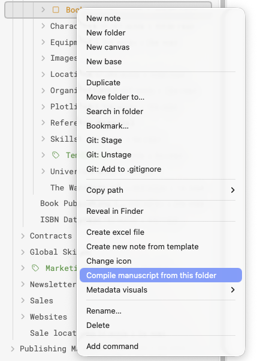
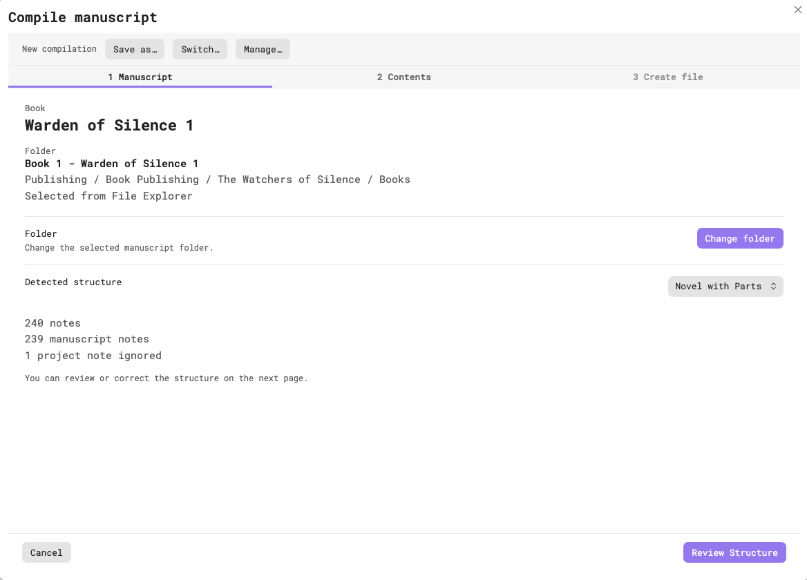
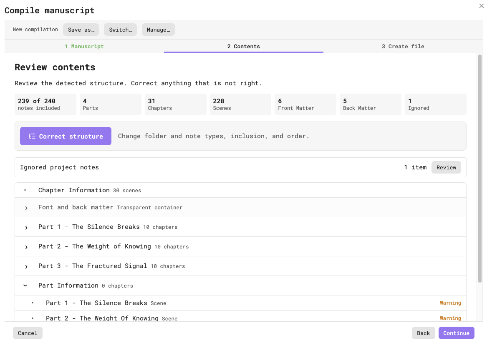
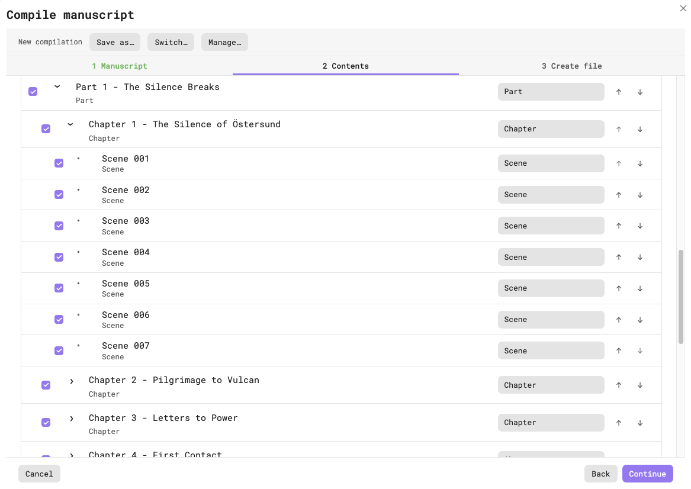

# Manuscript Compiler User Guide

## What Manuscript Compiler does

Manuscript Compiler turns an author-reviewed set of Markdown notes into DOCX, ODT, EPUB, HTML, Markdown, or XML. It runs locally in Obsidian, does not change your manuscript notes, and does not write generated files into the vault.

The workspace has three stages:

1. **Manuscript** — select the complete book folder and confirm its broad structure.
2. **Contents** — review inclusion, roles, and order.
3. **Create file** — prepare one output format and start the host download or share flow.

## Getting started

Install and enable Manuscript Compiler from [Obsidian Community Plugins](https://community.obsidian.md/plugins/manuscript-compiler). For a manual install, place the matching `main.js`, `manifest.json`, and `styles.css` release files directly in `<vault>/.obsidian/plugins/manuscript-compiler/`, then reload Obsidian and enable the plugin.

The recommended starting point is the complete book root:

1. Open File Explorer and locate the folder containing the complete book.
2. Right-click that book folder.
3. Choose **Compile manuscript from this folder**.

Manuscript Compiler opens with that folder as the manuscript root. Do not start from an individual Chapter or Scene: it can compile only material inside the folder you select, so a Chapter or Scene selection would omit the rest of the book.

You can also open **Compile manuscript** from the command palette, or choose **Open compiler** in the Manuscript Compiler settings. These routes open the compiler without an already-selected book folder, so choose the complete book root on the Manuscript stage.

> **Screenshot 1 — Start from a book folder**
>
> **Where:** File Explorer, with a neutral/sample complete book folder right-clicked.
>
> **Show:** Enough of the folder hierarchy to make the selected folder clearly the book root, plus the open context menu with **Compile manuscript from this folder** fully visible. Do not include private manuscript prose, personal vault names, or unrelated panes.
>
> **Purpose:** Shows that compilation begins from the complete book folder, not an individual Chapter or Scene.

  

## Manuscript structure

The compiler recognises **Front matter**, **Part**, **Chapter**, **Scene**, and **Back matter**. It also recognises **Transparent container** folders: these organise notes in the vault but do not create headings in the generated manuscript. Typical project folders such as Research, Development, Archive, Dashboards, Templates, and Exports are excluded by default and remain reviewable on Contents.

Choose the structure preset that most closely matches the manuscript. Presets guide initial detection; the choices you make on Contents are authoritative.

- **Novel with Parts** — Parts contain Chapters, which contain Scenes.
- **Novel without Parts** — Chapters contain Scenes; no Parts are required.
- **Chapter Notes** — each Chapter is a note.
- **Short Story** — manuscript notes without a Part/Chapter hierarchy.
- **Anthology** — a multi-work collection.
- **Custom** — an established non-standard layout.

For files structurally designated as **Scene**, the Scene title is structural information rather than manuscript body text. A leading Scene heading is not emitted in the compiled manuscript. Later headings authored in the Scene body remain part of the manuscript.

> **Screenshot 2 — Manuscript stage**
>
> **Where:** Open a neutral sample book in the **Manuscript** stage immediately after detection.
>
> **Show:** The **Manuscript** stage selected, the book title and selected book folder, the **Detected structure** control with its active preset, the note/ignored-note scan summary, and **Review Structure**. Include enough of the workspace to identify Manuscript Compiler, but avoid private paths or manuscript prose.
>
> **Purpose:** Shows what Manuscript Compiler detected and what the user should verify before proceeding to **Contents**.

  

## Review Contents

Use Contents to confirm that the expected Parts, Chapters, Scenes, front matter, and back matter are included and in the right order. Read the summary, expand representative branches, and inspect transparent containers, ignored project notes, and current structure warnings before continuing. Transparent containers organise notes without producing a heading of their own in the compiled manuscript.

Choose **Correct structure** to edit inclusion, role, and order. The available roles are Front matter, Transparent container, Part, Chapter, Scene, Back matter, and Exclude. Use **Finish correcting structure** when you are done. These choices affect only the compilation; they never rename, move, or rewrite the source notes.

> **Screenshot 3 — Contents review**
>
> **Where:** Open a neutral sample book in **Contents** before activating **Correct structure**.
>
> **Show:** **Contents** selected; the included-note, Part, Chapter, Scene, Front Matter, Back Matter, and Ignored summary; **Correct structure**; **Ignored project notes** with **Review**; a representative hierarchy including a Transparent container and Parts; genuine warning labels where present; **Back** and **Continue**. Do not use the correction-mode screen or include private prose.
>
> **Purpose:** Shows the normal review state and what to verify— inclusion, detected structure, transparent containers, ignored project notes, and genuine current warnings—before changing anything.

  

> **Screenshot 4 — Correct structure**
>
> **Where:** On **Contents**, after selecting **Correct structure** for a neutral sample manuscript.
>
> **Show:** An expanded Part and Chapter with Scene rows; inclusion checkboxes, disclosure controls, role selectors showing Part, Chapter, and Scene, Move up/down controls, and **Back** and **Continue**. Do not show private manuscript prose.
>
> **Purpose:** Shows how to change inclusion, role, and order without renaming, moving, rewriting, or otherwise modifying source notes.

  

## Saved Compilations

A **Saved Compilation** stores a reusable setup for a manuscript: its selected root, reviewed Contents choices, output choices, and formatting. It does not store a copy of the manuscript prose and does not create an output file.

There are two different kinds of saving in Manuscript Compiler:

- **Save Changes** saves the current Saved Compilation configuration for later reuse.
- **Create and download** creates the selected manuscript file and starts the host download/share flow. It does not save a configuration unless you explicitly choose a save option when prompted.

### Create a Saved Compilation

Start a **New compilation**, choose the manuscript folder, and review Contents. Select **Save as…**, enter a name in the **Save compilation** dialog, and choose **Save**. The current workspace becomes that Saved Compilation; the prepared manuscript does not need to be rebuilt solely because it was saved.

Use **Save Changes** when a Saved Compilation has unsaved setup edits. This updates that same Saved Compilation. The button is disabled when there is nothing new to save.

Use **Save as…** to create a separate Saved Compilation from the current choices. It does not overwrite the current Saved Compilation.

> **Screenshot 5 — Saved Compilation header**
>
> Open an existing Saved Compilation with a harmless changed setting so **Save changes** is enabled. Show its name and the **Save changes**, **Save as…**, **Switch…**, and **Manage…** controls. Do not show private manuscript prose. This teaches that these controls save and organise a setup, not a generated file.

### Open, switch, and manage Saved Compilations

Use **Switch…** to move between **New compilation** and Saved Compilations for the current manuscript folder. If the current setup has unsaved changes, choose **Cancel** to stay where you are or **Discard and switch** to leave those setup edits behind.

Use **Manage…** to work with Saved Compilations for the current manuscript folder:

- **Rename** changes only the display name.
- **Duplicate** makes another saved setup without switching to it.
- **Delete** removes only the saved setup. It never deletes manuscript notes or previously generated files.

If a Saved Compilation’s folder has moved, use **Locate manuscript…** to select its new folder, then choose **Save changes** to retain that association.

### Files detected but not currently included

When an existing Saved Compilation is reopened, the manuscript may contain files that were not part of its saved setup. Contents can show a collapsed **Files detected in this folder that are not part of this compilation** section. Expand it to inspect the names, then select **Add** only for files you want to include. Use **Save changes** afterwards if you want that addition retained in the Saved Compilation. Leaving a detected file out does not delete it or add it to the compilation.

> **Screenshot 6 — Detected files**
>
> Open a Saved Compilation whose folder contains one neutral new note not already included. On **Contents**, expand **Files detected in this folder that are not part of this compilation** and show one **Add** button. Keep the section title and count visible; use a neutral filename. This teaches that detected files are optional and starts collapsed.

## Create file and download output

On **Create file**, confirm the prepared summary, choose an output format, check the **Filename** field, and set the meaningful formatting options. The filename is the suggested download filename; its extension is corrected for the selected format when the file is created.

> **Screenshot 7 — Create file and format choice**
>
> Open **Create file** with a prepared sample manuscript. Show the prepared summary, the six format cards—DOCX, ODT, EPUB, HTML, Markdown, and XML—the **Filename** field, and the footer’s **Create and download DOCX** button. Select DOCX but do not start creation. This teaches where output format and suggested filename are chosen.

### The create decision

Choose **Create and download _format_** to create one file.

- From a New compilation, Manuscript Compiler asks whether to **Create without saving** or **Save and create**. The latter first opens the naming dialog for a new Saved Compilation, then creates the file.
- From a Saved Compilation with unsaved setup edits, it asks whether to **Create without saving** or **Save changes and create**.
- From a clean Saved Compilation, creation starts directly.
- Choosing **Cancel** in this decision dialog does not save the configuration and does not create a file.

> **Screenshot 8 — Save setup before creating**
>
> From a New compilation on **Create file**, click the Create button and capture the **Save compilation?** dialog. Show **Cancel**, **Create without saving**, and **Save and create**. Do not use an operating-system file dialog. This teaches that this prompt concerns the Saved Compilation configuration.

### Where the generated file goes

After creation and validation, Manuscript Compiler starts Obsidian’s/browser host download or share flow. The plugin does not show its own destination picker and cannot inspect the final filesystem location.

Depending on the operating system and host settings, the host may ask you to choose a filename and location, save to its configured Downloads location, or offer a share action. This is the same behavior for DOCX, ODT, EPUB, HTML, Markdown, and XML. No generated file is written into the vault before or after that handoff.

If you cancel or dismiss the host’s save/share flow, the plugin cannot confirm a completed external file. The Create file workspace remains available so you can try again. You can cancel preparation before final download dispatch; once the host download has started, it cannot be rolled back by the plugin.

> **Screenshot 9 — Host save or share flow**
>
> After creating a small sample file, capture the actual operating-system or Obsidian-host download/share prompt only if your platform presents one. Show the suggested filename and destination controls supplied by the host, with private paths redacted. If your platform saves directly to Downloads or opens a share sheet, capture that real host UI instead. This teaches that the destination experience is platform controlled, not a Manuscript Compiler screen.

> **Screenshot 10 — Creation complete**
>
> Return to the still-open **Create file** workspace after a successful sample export. Show the selected format, the Create button available for another export, and any unobtrusive success notice if it remains visible. Do not show personal download paths. This teaches that one prepared compilation can create more than one format.

## Output formats

- **DOCX** — native Word document for editing, submissions, and Vellum-oriented workflows.
- **ODT** — native OpenDocument Text file for LibreOffice and compatible editors.
- **EPUB** — reflowable EPUB 3 ebook for reader testing.
- **HTML** — self-contained offline browser document.
- **Markdown** — portable, readable manuscript Markdown.
- **XML** — semantic manuscript XML for interchange and automation.

### Formatting options

The visible controls depend on the selected format. DOCX and ODT offer **Document style** presets: Vellum, Standard manuscript, and Custom. DOCX, ODT, EPUB, and HTML support first-line indentation; the first paragraph after a heading or scene break remains flush left. Markdown does not have portable first-line indentation, and XML leaves presentation to its consumer.

The main controls include **Scene break**, **Add title page**, **Add table of contents** where supported, and **Start chapters on a new page** for DOCX and ODT. Open **Advanced formatting**—or **Advanced content options** for Markdown and XML—for title/author overrides, available typography controls, Part and Chapter heading styles, and the filename template. XML also offers **Include title page document**.

> **Screenshot 11 — Advanced formatting**
>
> Select DOCX or ODT on **Create file**, then expand **Advanced formatting**. Show the book-title and author overrides, font controls, page size, Part/Chapter heading styles, and filename template. Use neutral example values and leave source prose out of frame. This teaches which less-common controls are available without implying they apply to every format.

## Troubleshooting

### A note is missing or has the wrong role

Return to **Contents**, inspect **Ignored project notes**, then use **Correct structure** to include the note and set its role. Confirm its parent folders are not excluded.

### Create asks for a refresh

The manuscript notes or a setting that affects the prepared result changed after preparation. Select **Refresh preview** on Create file, review the result, then create the file again.

### The download does not start

Check whether the host blocked the download or share action, then try again. The plugin does not have a vault or desktop-filesystem fallback. Verify the final file in the location chosen by the host.

### A Scene title appears unexpectedly

Confirm that the file is assigned the **Scene** role on Contents. A structural Scene title is omitted only for structural Scene files; headings written later in the Scene body are retained intentionally.

## Known limitations

- Complex tables, embedded media, and advanced Markdown layouts are outside the manuscript model.
- Save and share behavior varies by operating system and host.
- Validate generated files in the application that will consume them, especially EPUB readers and publishing tools.
- Unusual vault layouts may need manual correction on Contents.

For installation, release, and interoperability details, see the [README](README.md), [Security Policy](SECURITY.md), and [Manual Release Checklist](MANUAL_TESTING.md).
