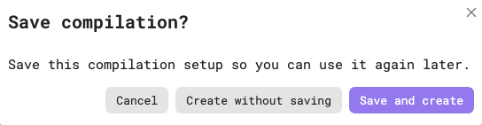
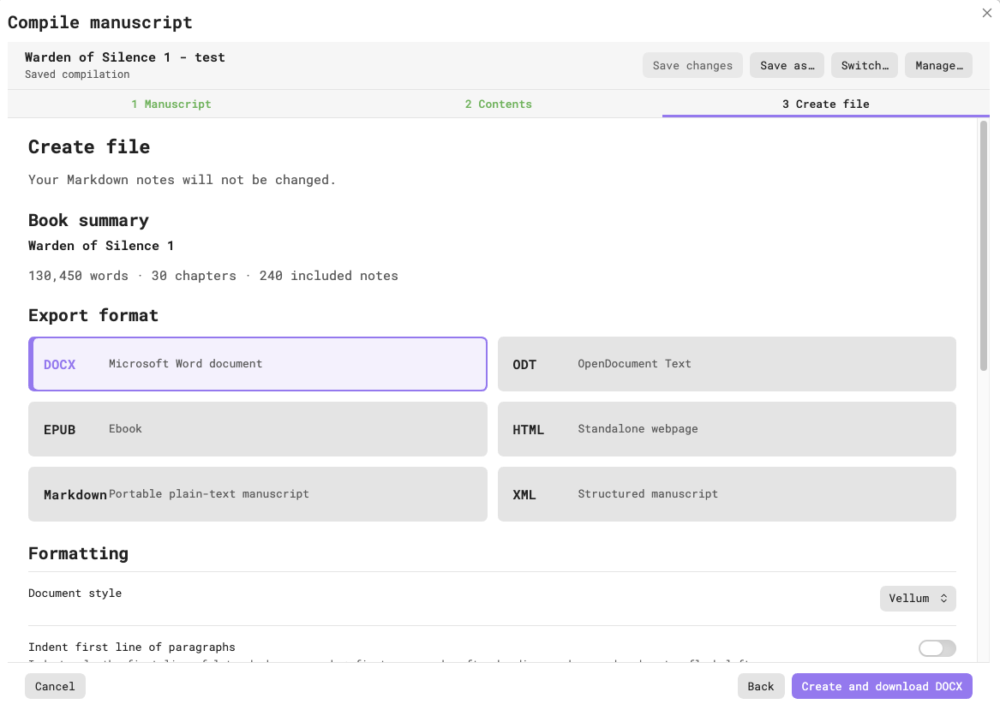
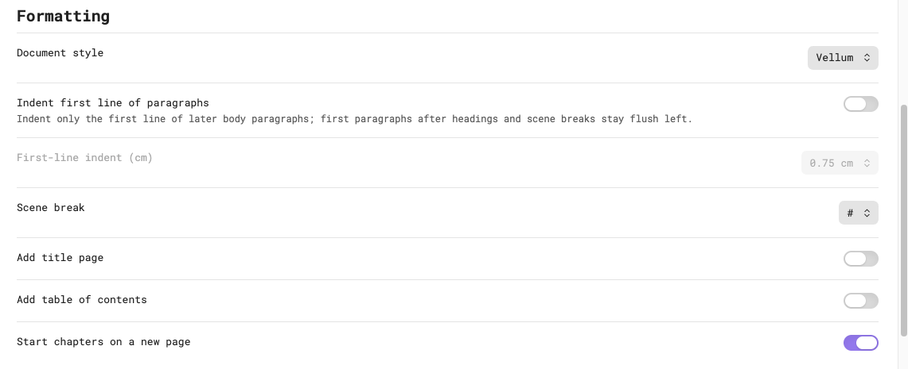
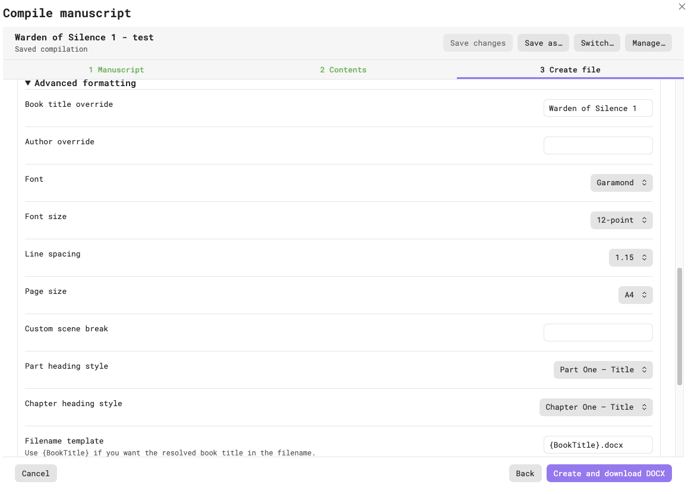

# Manuscript Compiler User Guide

## What Manuscript Compiler does

Manuscript Compiler turns an author-reviewed set of Markdown notes into DOCX, ODT, EPUB, HTML, Markdown, or XML. It runs locally in Obsidian, does not change your manuscript notes, and does not write generated files into the vault.

The workspace has three stages:

1. **Manuscript** — select the complete book folder and confirm its broad structure.
2. **Contents** — review inclusion, roles, and order.
3. **Create file** — prepare one output format and start the host download or share flow.

## Getting started

Install and enable Manuscript Compiler from [Obsidian Community Plugins](https://community.obsidian.md/plugins/manuscript-compiler). For a manual install, place the matching `main.js`, `manifest.json`, and `styles.css` release files directly in `<vault>/.obsidian/plugins/manuscript-compiler/`, then reload Obsidian and enable the plugin.

The recommended starting point is the complete book root:

1. Open File Explorer and locate the folder containing the complete book.
2. Right-click that book folder.
3. Choose **Compile manuscript from this folder**.

Manuscript Compiler opens with that folder as the manuscript root. Do not start from an individual Chapter or Scene: it can compile only material inside the folder you select, so a Chapter or Scene selection would omit the rest of the book.

You can also open **Compile manuscript** from the command palette, or choose **Open compiler** in the Manuscript Compiler settings. These routes open the compiler without an already-selected book folder, so choose the complete book root on the Manuscript stage.

  

*Screenshot 1 — Start from a book folder.*

## Manuscript structure

The compiler recognises **Front matter**, **Part**, **Chapter**, **Scene**, and **Back matter**. It also recognises **Transparent container** folders: these organise notes in the vault but do not create headings in the generated manuscript. Typical project folders such as Research, Development, Archive, Dashboards, Templates, and Exports are excluded by default and remain reviewable on Contents.

Choose the structure preset that most closely matches the manuscript. Presets guide initial detection; the choices you make on Contents are authoritative.

- **Novel with Parts** — Parts contain Chapters, which contain Scenes.
- **Novel without Parts** — Chapters contain Scenes; no Parts are required.
- **Chapter Notes** — each Chapter is a note.
- **Short Story** — manuscript notes without a Part/Chapter hierarchy.
- **Anthology** — a multi-work collection.
- **Custom** — an established non-standard layout.

For files structurally designated as **Scene**, the Scene title is structural information rather than manuscript body text. A leading Scene heading is not emitted in the compiled manuscript. Later headings authored in the Scene body remain part of the manuscript.

  

*Screenshot 2 — Manuscript stage.*

## Review Contents

Use Contents to confirm that the expected Parts, Chapters, Scenes, front matter, and back matter are included and in the right order. Read the summary, expand representative branches, and inspect transparent containers, ignored project notes, and current structure warnings before continuing. Transparent containers organise notes without producing a heading of their own in the compiled manuscript.

Choose **Correct structure** to edit inclusion, role, and order. The available roles are Front matter, Transparent container, Part, Chapter, Scene, Back matter, and Exclude. Use **Finish correcting structure** when you are done. These choices affect only the compilation; they never rename, move, or rewrite the source notes.

  

*Screenshot 3 — Contents review.*

  

*Screenshot 4 — Correct structure.*

## Saved Compilations

A **Saved Compilation** stores a reusable setup for a manuscript: its selected root, reviewed Contents choices, output choices, and formatting. It does not store a copy of the manuscript prose and does not create an output file.

There are two different kinds of saving in Manuscript Compiler:

- **Save changes** saves the current Saved Compilation configuration for later reuse.
- **Create and download** creates the selected manuscript file and starts the host download/share flow. It does not save a configuration unless you explicitly choose a save option when prompted.

### Create a Saved Compilation

Start a **New compilation**, choose the manuscript folder, and review Contents. Select **Save as…**, enter a name in the **Save compilation** dialog, and choose **Save**. The current workspace becomes that Saved Compilation; the prepared manuscript does not need to be rebuilt solely because it was saved.

Use **Save changes** when a Saved Compilation has unsaved setup edits. This updates that same Saved Compilation. The button is disabled when there is nothing new to save.

Use **Save as…** to create a separate Saved Compilation from the current choices. It does not overwrite the current Saved Compilation.

### Open a Saved Compilation

To access saved setups:

1. Open Obsidian **Settings** and select Manuscript Compiler.
2. Under **Saved compilations**, select **Manage saved compilations…**.

  

*Screenshot 5 — Manage Saved Compilations from Settings.*

3. Find the setup you want to use and select **Open**.
4. Manuscript Compiler opens the Saved Compilation and restores its saved configuration.

The manager lists each setup’s name, manuscript folder, vault-relative location, and selected output format. Use the search field to narrow the list.

  

*Screenshot 6 — Saved Compilations manager.*

Select **Open** to load the chosen setup back into Manuscript Compiler. **Delete** opens a confirmation and removes only the stored Saved Compilation setup; it does not delete manuscript notes, the book folder, source Markdown, or previously generated files.

  

*Screenshot 7 — Opened Saved Compilation.*

### Open, switch, and manage Saved Compilations

Use **Switch…** to move between **New compilation** and Saved Compilations for the current manuscript folder. If the current setup has unsaved changes, choose **Cancel** to stay where you are or **Discard and switch** to leave those setup edits behind.

Use **Manage…** to work with Saved Compilations for the current manuscript folder:

- **Rename** changes only the display name.
- **Duplicate** makes another saved setup without switching to it.
- **Delete** removes only the saved setup. It never deletes manuscript notes or previously generated files.

If a Saved Compilation’s folder has moved, use **Locate manuscript…** to select its new folder, then choose **Save changes** to retain that association.

### Include or exclude a new Scene

When a new Scene appears in **Contents**, use its inclusion checkbox to decide whether it participates in the compilation. The Scene remains structurally identified as **Scene** either way.

1. Open the Saved Compilation and go to **Contents**.
2. Select **Correct structure**.
3. Locate the Scene in the hierarchy.
4. Select its inclusion checkbox to include it; clear the checkbox to exclude it.
5. Select **Finish correcting structure** when you are done.
6. Select **Save changes** to retain the revised inclusion choice in the Saved Compilation.

Excluding a Scene affects only the compilation setup. It does not delete, rename, move, or rewrite the Scene note, and it remains in the vault.

  

*Screenshot 8 — Include or exclude a new Scene.*

In this example, the additional Scene remains a Scene in the structure, but its cleared checkbox keeps it out of the compiled manuscript.

## Create the manuscript file

On **Create file**, confirm the **Book summary**, choose an **Export format**, and review the available **Formatting** options. The stage confirms that your Markdown notes will not be changed: creating an export writes a separate output file and never rewrites the manuscript source.

The six formats are **DOCX** (Microsoft Word document), **ODT** (OpenDocument Text), **EPUB** (Ebook), **HTML** (Standalone webpage), **Markdown** (Portable plain-text manuscript), and **XML** (Structured manuscript). The available formatting controls depend on the selected format. For example, DOCX and ODT offer **Document style**; DOCX, ODT, EPUB, and HTML offer paragraph indentation; and title-page, table-of-contents, scene-break, and chapter-page controls appear where that format supports them.

  

*Screenshot 9 — Create file and choose a format.*

### Create and save the output file

Choose **Create and download _format_** to create one file. The button changes with the selected format, for example **Create and download DOCX** or **Create and download EPUB**. The **Filename** field lower on the Create file page supplies a suggested output name; it is safely normalised and its extension is corrected when the selected format changes or the file is created.

For a New compilation or a Saved Compilation with unsaved setup edits, first resolve the configuration decision described in the next section. A clean Saved Compilation begins output creation directly. After Manuscript Compiler generates and validates the file, the host starts its system save, download, or share flow. When a system save dialog appears, choose the filename and destination, then select **Save**. On macOS, this looks like the dialog below; its appearance varies by operating system and host.

  

*Screenshot 10 — Choose where to save the generated file.*

The plugin cannot inspect the final filesystem location. Depending on the operating system and host settings, the host may instead save to a configured Downloads location or offer sharing. No generated file is written into the vault. If you cancel or dismiss the host flow, no completed output file is confirmed; the **Create file** workspace remains open, and the cancellation makes no further change to the Saved Compilation configuration.

### Save the configuration before creating

**Save changes**, **Save as…**, and **Save** in the system dialog are different actions. **Save changes** updates the current Saved Compilation configuration; **Save as…** creates another Saved Compilation configuration; **Save** in the system dialog saves the generated manuscript output file.

From a **New compilation**, selecting **Create and download _format_** opens **Save compilation?**:

- **Cancel** returns to Create file without saving the setup or creating output.
- **Create without saving** continues toward output creation without making the current setup a Saved Compilation.
- **Save and create** opens the **Save compilation** dialog. Enter a **Name** and select **Save** to retain the setup, then output creation continues.

For a Saved Compilation with unsaved setup edits, the dialog is titled **Save changes?** and offers **Create without saving** or **Save changes and create**. A clean Saved Compilation starts creation directly, without this configuration decision.

  

*Screenshot 11 — Save setup before creating.*

### Create another output

After an output is handed to the host save, download, or share flow, the prepared **Create file** workspace remains open. There is no persistent creation-complete banner. You can select another format or use the current format again and choose **Create and download _format_** without rescanning or rebuilding the manuscript structure solely because you made an earlier output.

  

*Screenshot 12 — Create another output.*

## Output formats

- **DOCX** — native Word document for editing, submissions, and Vellum-oriented workflows.
- **ODT** — native OpenDocument Text file for LibreOffice and compatible editors.
- **EPUB** — reflowable EPUB 3 ebook for reader testing.
- **HTML** — self-contained offline browser document.
- **Markdown** — portable, readable manuscript Markdown.
- **XML** — structured manuscript XML for interchange and automation.

### Formatting options

Use **Formatting** for the common presentation choices on **Create file**. These settings affect the generated output only: they do not change source Markdown, note names, or manuscript folders.

The controls shown depend on the selected format. For DOCX and ODT, **Document style** selects the starting preset: **Vellum**, **Standard manuscript**, or **Custom**. DOCX, ODT, EPUB, and HTML also offer **Indent first line of paragraphs**. When it is enabled, **First-line indent (cm)** sets the amount; the first paragraph after a heading or Scene break remains flush left.

Choose a **Scene break** marker for the separator between Scene bodies: **#**, **\***, **\*\*\***, **\* \* \***, **Blank line**, or **Custom**. This controls the separator, not Scene titles: structural Scene titles are still omitted from manuscript body text. **Add title page** and, except for Markdown, **Add table of contents** add those generated elements to the selected output. **Start chapters on a new page** is available for DOCX and ODT.

Markdown instead describes its preserved plain-text structure and does not offer portable first-line indentation. XML leaves paragraph indentation to the application that consumes the XML.

  

*Screenshot 13 — Formatting options.*

### Advanced formatting

Open **Advanced formatting** for less-frequently changed, document-level choices. It is separate from the common **Formatting** controls above, and its contents vary with the selected output format. Markdown and XML call this disclosure **Advanced content options** instead.

**Book title override** changes the title used in generated output without renaming the book folder, source notes, or Saved Compilation. **Author override** supplies the author value used in generated content and metadata where the selected format supports it. For DOCX, ODT, EPUB, and HTML, the advanced controls also provide **Font** (Times New Roman, Garamond, Georgia, or Arial), **Font size** (11-, 12-, or 13-point), and **Line spacing** (Single, 1.15, 1.5 lines, or Double). **Page size** is available for DOCX and ODT, with A4 and Letter choices.

Use **Custom scene break** to enter the separator used when **Scene break** is set to **Custom**. **Part heading style** and **Chapter heading style** control how those structural headings appear, with number-only, title-only, and number-and-title choices. **Filename template** controls the suggested output filename; use `{BookTitle}` to insert the effective book title. Manuscript Compiler safely corrects the selected format's filename extension when it creates the file.

For XML, **Include title page document** appears in **Advanced content options**. The other advanced controls are shown only where they apply to the chosen output format.

  

*Screenshot 14 — Advanced formatting.*

## Troubleshooting

### A note is missing or has the wrong role

Return to **Contents**, inspect **Ignored project notes**, then use **Correct structure** to include the note and set its role. Confirm its parent folders are not excluded.

### Create asks for a refresh

The manuscript notes or a setting that affects the prepared result changed after preparation. Select **Refresh preview** on Create file, review the result, then create the file again.

### The download does not start

Check whether the host blocked the download or share action, then try again. The plugin does not have a vault or desktop-filesystem fallback. Verify the final file in the location chosen by the host.

### A Scene title appears unexpectedly

Confirm that the file is assigned the **Scene** role on Contents. A structural Scene title is omitted only for structural Scene files; headings written later in the Scene body are retained intentionally.

## Known limitations

- Complex tables, embedded media, and advanced Markdown layouts are outside the manuscript model.
- Save and share behavior varies by operating system and host.
- Validate generated files in the application that will consume them, especially EPUB readers and publishing tools.
- Unusual vault layouts may need manual correction on Contents.

For installation, release, and interoperability details, see the [README](README.md), [Security Policy](SECURITY.md), and [Manual Release Checklist](MANUAL_TESTING.md).
