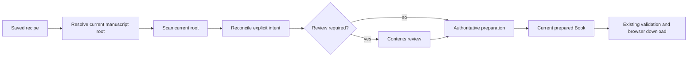

# Saved Compilations

> **Status: Parts 1–8 are complete. Parts 7–8 provide the visible workflow and root-scoped management UX.**

## Purpose and scope

A **Saved Compilation** is a persistent, manuscript-specific recipe describing how one manuscript should be compiled. It belongs to one manuscript root; any root may have many Saved Compilations, such as “Vellum Master”, “Editor DOCX”, “ARC EPUB”, and “Website HTML”. It is neither an exported file nor a reusable profile, and it never owns a copy of manuscript prose.

The current vault is always the source of truth. Opening a Saved Compilation means resolving the current root, scanning current content, reconciling safe saved intent, surfacing uncertainty, preparing a current `Book`, and using the existing export transaction.



This specification is constrained by [the Obsidian API reference](SAVED_COMPILATIONS_OBSIDIAN_API.md), [the current architecture](../ARCHITECTURE.md), and existing privacy, preparation, exporter, and mobile rules.

## Definitions and ownership

| Layer | Purpose | Persisted conceptually | Explicitly not persisted |
| --- | --- | --- | --- |
| Identity | Identifies the recipe independently of its label | Immutable internal ID, name, optional description, lifecycle timestamps, root reference | Name as primary key; `TFile`/`TFolder` instances |
| Manuscript recipe | Captures author-authoritative publishing decisions | Explicit structural overrides and manual order evidence | Re-derivable inference, raw Markdown, parsed `Book` |
| Output configuration | Captures this compilation’s resolved output choices | Chosen format, filename, formatting and cleaning choices | Generated bytes, Blob URLs, save destination |
| Observed source state | Supports reconciliation | Compact path/structure evidence | Prose, whole YAML/frontmatter, absolute paths |

The immutable ID is the only primary key. Names are user-editable display values; duplicate labels are permitted but the UI should discourage confusing duplicates by proposing a distinct name. A Saved Compilation records created, modified, last-opened, and—after a truthful successful download dispatch—last-successful-export timestamps. Description is optional and bounded. Timestamps are facts about plugin state, not proof of external-file persistence.

## Recipe: inferred state versus user intent

The initial scan continues to infer a complete `ContentPlanItem[]`. Saved Compilations persist **only author intent that differs from or constrains inference**:

- local inclusion/exclusion changes, including manual changes in otherwise ignored folders;
- role changes for notes/folders: front matter, transparent, Part, Chapter, Scene, back matter, or ignore;
- manual sibling order where the author changed it;
- explicit hierarchy/transparent-container choices represented by those roles;
- explicit matter-role inheritance exceptions, so a later inherited parent role does not erase a child choice.

The saved recipe must distinguish “author explicitly chose this” from “this was simply inferred when last opened.” It must not persist every automatic role, every exclusion reason, scanner warning, or derived `useParts`/`chapterSource` value merely to replay an old scan. Current inference remains useful for newly created and untouched items, and `applyContentPlan` remains the bridge to the parser.

Explicit choices are restored only when the referenced current item is confidently resolved. They remain authoritative over current inference when restored. No override may be silently assigned to a merely similar item.

## Output configuration and precedence

Saved Compilations preserve the effective choices made for that compilation, not references that can later drift with global defaults or profile edits. Current audited controls are:

| Area | Current controls a Saved Compilation preserves |
| --- | --- |
| Format/delivery | `docx`, `odt`, `epub`, `html`, `markdown`, or `xml`; portable filename/template. Browser-hosted delivery remains unchanged. |
| DOCX style | Vellum, Standard Manuscript, or Custom; font, size, line spacing, paragraph-indent toggle/amount, A4/Letter, chapter page break, title page. |
| Cross-format presentation | title/author override, scene separator/custom scene break, table of contents where applicable, Part/Chapter display, and body-heading presentation. |
| Structure/cleaning | structure preset and resolved author choices; front/back matter choice; ordering; metadata filters; current cleaning controls including YAML/comments/Dataview/callouts/internal links/body aliases. |

The UI currently hides controls that have no effect: Markdown/XML do not express portable paragraph indentation; XML is presentation-neutral; table of contents is unavailable for Markdown. A saved recipe records only meaningful current settings and normalizes format-inapplicable settings rather than inventing new ODT/EPUB/HTML/Markdown/XML option families.

Precedence is fixed:

```text
plugin defaults → selected profile/preset while creating a new compilation
                → saved compilation’s resolved values when loading one
                → temporary workspace edits
```

Profiles remain cross-manuscript reusable defaults/templates. A Saved Compilation is manuscript-specific, stores the resolved profile-derived values that matter to its output, and is not retroactively changed by a profile or global-default edit. A loaded recipe may retain safe provenance for display/history, but provenance must not override its resolved values.

## Multiple compilations, selection, and first save

Multiple compilations per root are first-class. The list groups by resolved root and sorts most recently opened first; within equal recency it sorts by name using locale-aware comparison. The product does not require a permanent default compilation: reopening the most recently used valid compilation is a convenience, never a hidden automatic export selection.

### New versus saved

- **New compilation** begins with current root inference and current plugin defaults/profile/preset choices. It is transient until an author explicitly saves it.
- **Saved compilation** begins with current root + current inference + safely reconciled explicit saved recipe + saved output choices. Its loaded identity and dirty state are visible in the existing workspace.

The first persistence point is an explicit **Save compilation** action. It asks for a name, proposes one from the effective format/style (for example “DOCX — Vellum”, “ARC EPUB”, or “Markdown Archive”), permits editing, and creates exactly one recipe. Exporting a transient compilation never silently creates a Saved Compilation. Closing a dirty transient compilation offers Save compilation, Discard, or Cancel.

## Management and save semantics

| Action | Effect and confirmation | Failure/cancellation/privacy |
| --- | --- | --- |
| Save compilation | First explicit save of a transient workspace; prompts for an editable name. Persists the current recipe and output configuration, not a Book/prose/export. | Save failure leaves the workspace loaded and dirty; no partial success notice. Closing the naming UI cancels without creating a recipe. |
| Save changes | Writes modifications to the currently loaded Saved Compilation. No confirmation. | Failure preserves dirty state and reports a redacted error. It does not re-run preparation. |
| Save as new | Prompts for a name, copies the current recipe/output choices into a new ID, and loads the new recipe. | New entry has fresh created/modified/opened facts and no inherited successful-export identity. |
| Duplicate | A management action that prompts for a name and copies the persisted recipe into a fresh ID without switching to it. | Copies persisted author intent/output values without an active unsaved overlay. |
| Rename | Changes only display name/modified timestamp. No confirmation. | Internal ID, recipe, and export state remain unchanged. |
| Delete | Deletes only the selected recipe after a destructive confirmation naming that recipe. Deleting Current retains the usable in-memory workspace as New rather than closing it. | Never touches notes, folders, profile, history, or external files. Failure leaves it listed. |
| Switch | Resolves/reconciles the target current recipe. If the current workspace is dirty, offer Save changes, Discard changes, or Cancel first. | Cancels any owned cancellable preparation before replacement; no uncontrolled background work. |

Save actions persist an intentional recipe snapshot. They do not persist source-derived warnings, raw scan results, prepared sessions, current validation bytes, or an export destination.

## Dirty state

Dirty state compares the loaded recipe snapshot with the current workspace’s persistable recipe projection—not with the current `Book`, source fingerprint, or last export. It becomes dirty for inclusion, role, order, root association, structure/cleaning, format, filename, title/author, display, TOC, scene-break, and formatting edits. It does not become dirty merely because source prose changed or a source event arrived.

Export may proceed with dirty recipe edits if the current manuscript has been prepared and prepared-source checks pass. The result is truthfully an export of unsaved choices. Closing, switching, creating a new compilation, or re-associating a root prompts only for dirty recipe changes: **Save changes**, **Discard changes**, or **Cancel**. “Discard” restores the last persisted recipe then reconciles it against the current vault; it never reverts manuscript notes.

## Source reconciliation and staleness

### Reconciliation evidence and confidence

Paths are evidence, not permanent identities. Reconciliation starts with the previous path relative to the manuscript root and validates kind, ancestry, and saved structural context. It can use compact previous filename, parent context, persisted explicit role, and a non-prose content fingerprint/stat evidence where already available. It must not use an opaque clever/fuzzy matcher that could bind intent to the wrong note.

| Outcome | Rule | Result |
| --- | --- | --- |
| Exact resolve | Same current relative path and compatible kind | Restore explicit override automatically. |
| Safe root relocation | Old root-relative structure resolves under a user-confirmed new root | Rebase references; restore exact descendants. |
| Evidenced single rename/move | Exactly one candidate has strong, non-ambiguous evidence and no competing candidate | May propose an automatic re-association, visibly recorded for review before save. |
| Ambiguous candidate(s) | More than one plausible target or weak/conflicting evidence | Do not bind; mark reconciliation required. |
| No candidate | Item no longer exists | Retain a missing reference for review; never reuse it. |

Automatic restoration is appropriate for exporter/formatting/filename choices, and for explicit inclusion, roles, inheritance exceptions, and manual sibling ordering on confidently resolved current items. It stops for uncertain/missing/ambiguous references, incompatible kind changes, and manual order whose siblings cannot be confidently resolved.

### Change matrix

| Current-vault change | Restore/review policy | Export effect |
| --- | --- | --- |
| Existing file prose changed only | Preserve resolved structural recipe; mark source content changed. | Preparation/export can proceed from current text after refresh. |
| Existing file’s metadata changes but inference/override stays compatible | Preserve explicit recipe; mark source changed; show normal review only if it changes derived structure. | Current preparation required; export available after it. |
| Content/metadata changes structure | Explicit choices still win where mapped; surface structural review for changed inference/conflicts. | Block until required reconciliation/review is resolved. |
| New Scene under included Chapter | Include by current inference, inherit parent inclusion, and show a compact **Review changes** summary. | Export is available after the session-local review acknowledgement; no per-Scene acceptance is required. |
| New Chapter / new Part | Infer and include when parent/root policy makes it publishable; flag prominent structural addition. | Review required before export. |
| New front/back-matter note | Infer by current matter location; flag as new matter. | Review required before export. |
| New project/development/unknown note | Apply current conservative inference. Ignored items remain ignored; unknown items remain reviewable rather than silently published. | No block if clearly ignored; review if publishability is ambiguous. |
| New item beneath excluded folder | Remain effectively excluded through the saved parent intent and appear as optional detected content. | No block; the author may leave it out or use **Add** to create unsaved intent. |
| Deleted Scene | Keep a missing-reference warning only when saved included/structural intent needs it. A safely irrelevant saved exclusion is quiet. | Blocks only while unresolved structural/missing-content review remains. Never recreate it. |
| Deleted Chapter/Part/folder | Mark structural reconciliation required; do not silently collapse/reparent old manual order. | Block until review. |
| Scene rename/move | Restore only through exact/safe evidence; otherwise missing + review. | No block after safe confirmation; otherwise block. |
| Chapter/Part/folder rename/move | Same, plus re-evaluate descendant ancestry/order. | Structural review when any mapping is uncertain. |
| Root rename/move | Resolve via stored root path if present; otherwise offer explicit re-association. | No preparation/export without an author-confirmed root. |

The new-file decision deliberately favors not silently omitting newly written manuscript content while retaining existing conservative ignored-folder rules. New publishable material is included by normal inference but requires review before export; accidental dashboards/research do not become content merely because the root is scanned.

### Staleness states

Staleness is a set of independently reportable conditions, not one boolean.

| State | Meaning | Required response |
| --- | --- | --- |
| Ready | Recipe is resolved; no unresolved structural changes; a current preparation may still be required. | Prepare/export normally. |
| Source content changed | Current resolved files differ from observed source state without unresolved recipe mapping. | Refresh/prepare current Book; preserve recipe. |
| Structure changed | Current inference/ancestry conflicts with saved context or changes publishable structure. | Contents review required. |
| New publishable items | Current scan found new inferred content under an included branch. | Compact advisory review acknowledgement before export; source-derived items do not become recipe overrides. |
| Missing references | Saved explicit intent points to absent items. | Review; may acknowledge expected evolution where non-blocking. |
| Reconciliation required | A rename/move/root association or ordering mapping is ambiguous/unsafe. | Resolve explicitly before export. |
| Recipe modified | Workspace choices differ from persisted saved recipe. | Save, discard, or export unsaved choices. |
| Output settings changed | A subset of Recipe modified that affects generated bytes. | Reprepare current session before export. |

## Root moves and re-association

An exact root path resolves normally. When it does not, the Saved Compilation is **unassociated**, not deleted. The list identifies it without exposing the old path in diagnostics. Opening it offers **Locate manuscript** / **Re-associate manuscript**, using the existing folder chooser and requiring an explicit `TFolder` selection. The user confirms the candidate root after the scanner presents a reconciliation summary. Only then may relative references be rebased and stored on Save changes. The system never searches the entire vault and silently selects a plausible root.

This handles root rename, root move, and moving/copying a whole manuscript while protecting against a similarly named manuscript. Re-association starts a reconciliation review; it is not a promise that all old descendants match.

## Prepared-source safety

`PreparedCompileSession` carries an included-source content fingerprint and semantic input signature. `ExportCoordinator` recalculates both before delivery so a changed prepared source requires refresh; these values are session-only safety checks.

1. compare observed source content at reopen time;
2. identify that an earlier prepared session must be rebuilt;
3. supply conservative evidence during reconciliation, never an identity guarantee; and
4. determine whether last successful export corresponds to the current recipe/source state.

They never contain input text. Fingerprint values are privacy-sensitive implementation evidence: diagnostics do not dump them, and support reports use only counts/statuses. “Last exported” means a validated export whose browser download dispatch began; it cannot mean that the plugin knows where a file was saved or that it remains on disk.

## Workflow and UI model

Saved Compilations enhance—not replace—the existing **Manuscript → Contents → Create file** workflow. There remains one `CompilePreparationService.prepareAuthoritative` route, one current `Book`, one `SemanticDocument`, and one export coordinator.

The least disruptive entry is a compact Saved Compilations area at the top of the existing Manuscript stage, after a root is selected (or a lightweight chooser reached by the existing folder/command launch). It lists recipes for that root, their format/style and concise status, and **New compilation**. It does not add a fourth wizard stage or a desktop-only management view.

When a recipe is loaded, the workspace header has a compact, accessible indicator, for example:

```text
Vellum Master · Saved compilation
Source changed · No unsaved recipe changes
```

The header/link opens a small contextual menu rather than a permanent toolbar: Save changes, Save as new, Duplicate, Rename, Delete, Switch compilation, and—where relevant—Review source changes or Re-associate manuscript. The first save uses a focused naming modal. Delete uses a focused destructive confirmation. All essential actions remain available on mobile without relying on a native desktop context menu.

## Lifecycle, cancellation, concurrency, and events

Opening, switching, refreshing, and re-associating are controller-owned operations. They use the existing single global operation state and cancellation vocabulary; rapid switching cancels/replaces only cancellable preparation, never export finalisation. A completed preparation is tied to the exact recipe/current plan that produced it. Recipe edits invalidate prepared state when they affect semantic output; filename/format behaviour remains consistent with current invalidation rules.

Vault and metadata events are registered with `registerEvent` and must be delayed/gated until layout readiness. They do **not** rescan every saved recipe or parse every manuscript. Their normal effect is cheap: mark a recipe whose root/current observed scope may be affected. Reconciliation happens when that recipe is loaded, explicitly reviewed, or prepared. Source changes during preparation are caught by existing final fingerprint checks and require refresh; they must not result in a partial export.

Saving recipe state during preparation is allowed if it snapshots only workspace choices and is serialized through the persistence owner. Export begins only from a current prepared session; if recipe changes invalidate semantics, export is unavailable until preparation catches up. No separate uncontrolled reconciliation job, second operation lock, or saved-export pipeline is permitted.

## Persistence, privacy, security, and recovery

### Persistence and performance

Persist compact structural facts and bounded observed-state evidence. Large manuscripts and many recipes are expected; opening one may scan its current root and prepare the current `Book`. The workflow benefit is saved author decision-making, not a hidden prose cache or zero-cost opening.

Do not persist manuscript prose, parsed Books, generated bytes, Blobs, screenshots, thumbnails, full YAML, absolute filesystem paths, external destinations, or raw diagnostics. Bound retained history, stale/missing-reference records, diagnostics summaries, strings, arrays, and nested structures during the later model/repair stage. Existing performance evidence remains the 500-chapter/2,000-scene/two-million-word benchmark; implementation must avoid repeated whole-vault scans, quadratic reconciliation, or eager all-recipe work.

### Privacy boundary

Allowed persisted categories are relative root/item paths, display names, roles, ordering, output/cleaning settings. Relative paths and names may still be sensitive. Diagnostics may report counts (Saved Compilations, statuses, malformed entries, schema state) but must redact names, paths, filenames, fingerprints, recipes, metadata values, and export destinations. Support export must never dump the saved-compilation database.

### Security and failure recovery

`loadData()` is untrusted input. The required future boundary is:

```text
unknown → validate shape and bounds → migrate known historical form → repair → domain state
```

Repair handles malformed arrays/objects, unexpected nesting, prototype-like keys, oversized strings, invalid IDs/timestamps/enums, impossible order values, obsolete formatting, unknown exporters, partial data, and manually edited `data.json`. It must be idempotent and isolate entries: one malformed Saved Compilation is discarded/quarantined with a redacted configuration warning, not allowed to crash startup or erase unrelated recipes. Safe valid portions of a partially malformed entry are retained only when that cannot silently change author intent; otherwise the entry requires review.

Unsupported old data is preserved as safely as possible and surfaced as an actionable repair issue. Missing roots, missing notes, impossible manual order, and obsolete settings become reconciliation/review states, not fatal plugin errors. Save failures leave memory state intact and visibly dirty.

### Migration policy

Saved Compilation persistence needs its own schema versioning in Part 3. Migrations translate only known previous schemas, preserve explicit false/zero/custom values, avoid destructive reset, and pass a second idempotence run unchanged. Repair runs around migration because both historical and manually edited data can be malformed. Unknown future fields are not interpreted or activated by older code; the precise preservation policy needs the Part 3 data-model evidence.

## Relationship to history, diagnostics, and future interoperability

Compile history remains bounded, outcome-based, and prose-free. Later history records may link to a safe Saved Compilation immutable ID plus format, only after a truthful terminal outcome; they must not use a mutable name or paths as identity. Duplicating or deleting a recipe does not alter unrelated history.

Diagnostics later report aggregate safe facts only: count of recipes, count by reconciliation state, schema/repair count, and whether a recipe is loaded. Names, relative paths, filenames, fingerprint values, and structural contents remain redacted. Existing diagnostics must not start reading notes to produce this report.

No optional integration is designed or implemented. If Metadata Visuals, Publishing Manager, or another plugin later needs safe Saved Compilation facts, Manuscript Compiler would need an explicitly designed/versioned public capability. Do not use undocumented plugin-manager internals, expose prose, retain foreign plugin instances, or make another plugin mandatory.

## User scenarios

| Scenario | Detection and UI | Persisted result / export |
| --- | --- | --- |
| 1. Create first Saved Compilation | New workspace is transient; author selects Save compilation and edits proposed name. | New immutable-ID recipe stores choices only. Export was never required. |
| 2. Reopen unchanged manuscript | Root/path and observed state resolve; header says Ready. | Last-opened updates after successful open; prepare/export use current scan/Book. |
| 3. Edit prose only | Fingerprint/stat comparison shows source content changed, no mapping conflict. | Recipe unchanged; refresh prepares new prose. |
| 4. Add Scene | Scan finds new publishable Scene under included Chapter. | Contents flags it; author accepts/changes it before export. Save captures an override only if author changes inference. |
| 5. Add Chapter | New structural child is inferred and flagged for review. | Export waits for review; explicit prior order remains for resolved siblings. |
| 6. Delete Scene | Saved explicit reference is absent. | Missing-reference review explains it; export can continue only after author resolves/acknowledges non-blocking evolution. No note is recreated. |
| 7. Rename Scene | Exact path fails; safe evidence may identify one candidate, otherwise review. | No silent reassignment. Confirmed mapping can be saved; current source is prepared. |
| 8. Move Chapter | Parent/ancestry and manual sibling order may no longer map. | Structural review is required until mappings/order are safe. |
| 9. Rename root | Stored root is missing. Locate manuscript requires explicit folder selection and reconciliation summary. | Save changes rebases only after confirmation; no automatic whole-vault selection. |
| 10. Duplicate Vellum Master as Agent Submission | Duplicate action asks for name and loads new recipe. | New ID/timestamps, copied recipe/output choices. |
| 11. Change global defaults | Existing recipe opens with its stored resolved values. | No automatic rewrite or dirty state. New compilation receives new defaults. |
| 12. Malformed saved entry | Repair isolates bad fields/entry and presents redacted configuration warning. | Other recipes load; malformed item never crashes startup. |
| 13. Switch among recipes | Current dirty state prompts Save/Discard/Cancel; target then reconciles. | Each identity retains independent choices and timestamps. |
| 14. Export with unsaved recipe changes | Header says unsaved changes; current session must be prepared. | Export is allowed; recipe remains dirty. |
| 15. Source changes while open | Event marks potential staleness; final existing fingerprint check catches change before delivery. | Refresh required; no stale/partial export or automatic recipe rewrite. |

## Invariants

1. Manuscript notes remain the source of truth.
2. Saved Compilations never own manuscript prose, a serialized `Book`, or export bytes.
3. Saved Compilations never write manuscript content or external files.
4. An uncertain file/root mapping never receives an old override silently.
5. Explicit author structure/order choices survive whenever safely reconciled.
6. Every export prepares/uses current source through the one authoritative route.
7. Persisted, loaded, dirty, and source-stale state remain distinguishable.
8. Many Saved Compilations may belong to one manuscript root.
9. Deleting a Saved Compilation deletes only its recipe.
10. Preview and every exporter retain the same prepared `Book` instance.
11. Invalid persisted state cannot crash startup; one bad entry cannot destroy other entries.
12. Global defaults and profiles cannot silently mutate an established recipe.
14. Runtime remains offline, mobile-safe, dependency-restrained, and Vault-API based.
15. Diagnostics/history remain prose-free and redact sensitive saved-recipe facts.
16. Saved-recipe reconciliation does not create an alternate scanner/parser/export pipeline.
17. Reconciliation/event work is scoped and lazy enough for large vaults.
18. Cancellation and operation ownership remain truthful through switching, preparation, and export finalisation.

## Initial non-goals

- Caching full Books, raw Markdown, frontmatter, or source-note snapshots.
- Saved manuscript revision history, version-control replacement, or automatic merge of diverged vault copies.
- Export-file storage, destination tracking, external filesystem monitoring, cloud upload, or KDP/Ingram/Vellum automation.
- Automatic cloud synchronization beyond whatever Obsidian applies to plugin `data.json`.
- A desktop-only Saved Compilations interface or Node/Electron/Adapter/shell dependency.
- Dependency on Metadata Visuals, Publishing Manager, Pandoc, or another community plugin.
- Undocumented cross-plugin APIs or a public Manuscript Compiler API in this feature’s initial delivery.
- New export formats or format-specific controls not already supported.

## Open questions for Part 3

1. What exact compact evidence is sufficient to distinguish a safe rename/move proposal from an ambiguous one? Part 3 needs candidate fixture analysis before defining stored fields.
2. What bounded per-entry/collection limits best fit current `history-storage` policy and the large-manuscript benchmark? Part 3 needs a concrete model and size tests.
3. Should an unsaved-recipe export update an in-memory “last exported” indicator only, or omit that indicator until save? Part 3 needs persistence semantics that do not falsely associate history with an older recipe snapshot.
4. How should an acknowledged intentionally deleted reference be represented without accumulating unbounded tombstones? Part 3 needs retention/repair rules.
5. Is `onExternalSettingsChange` necessary for a first implementation, and how should it handle an open dirty workspace? Part 3 needs lifecycle/error-handling design and supported-version testing.

## Implementation stage map

1. **Part 3 — Persistent data model, schema versioning, validation and migration**
2. **Part 4 — Saved Compilation storage/service layer**
3. **Part 5 — Source reconciliation, fingerprinting and staleness engine**
4. **Part 6 — Integration with preparation/export architecture**
5. **Part 7 — Saved Compilation UI/workflow**
6. **Part 8 — Management operations: duplicate/save-as/rename/delete/multiple compilations**
7. **Part 9 — Full testing, security, privacy, performance and documentation**
8. **Part 10 — Final Obsidian compliance and release-readiness audit**

## Part 3 persistence contract

Part 3 implements the dormant schema-1 persistence boundary described in [Saved Compilations Schema](SAVED_COMPILATIONS_SCHEMA.md). The existing settings object now owns a versioned, bounded Saved Compilations collection. It validates and repairs entries independently; preserves explicit structural overrides, compact sibling-order facts, resolved output choices, root/item evidence; and excludes prose, Book graphs, raw metadata, bytes, absolute paths, and destinations.

Schema 1 uses immutable local IDs, normalized relative paths, Unix-millisecond timestamps, a conservative root/item reference model, and deterministic recipe equality that ignores observed-source evidence. See the schema document for the exact limits, duplicate-ID policy, unknown-future-schema isolation, and synthetic JSON example.

## Part 4 storage service

`SavedCompilationService` is the sole runtime owner of Saved Compilation mutations. Plugin startup repairs settings and then initializes this service without vault access, scanning, reconciliation, UI creation, or preparation. It offers immutable listing/ID lookup and normalized root-path convenience lookup; typed mutation APIs cover explicit creation, Save Changes, Save As/Duplicate, rename, delete, root reassociation, last-opened tracking, observed-source replacement.

Each mutation replaces a normalized schema-1 snapshot and enters an ordered full-settings save queue. A persistence failure is reported as a structured result and leaves the latest state marked unpersisted for a later successful write; it does not claim success or roll back newer queued work. A newer unsupported schema puts the service in an unavailable state and preserves the raw envelope through unrelated settings saves.

Part 4 does **not** reconcile paths, inspect the vault, register vault events, restore a workspace, create UI/commands, or alter preparation/export routes.

## Part 5 reconciliation engine

Part 5 implemented the pure, conservative reconciliation contract in [Saved Compilations Reconciliation](SAVED_COMPILATIONS_RECONCILIATION.md). It restores only exact or uniquely fingerprint-proven references into a copied current Content Plan, reports source/structural/missing/new states, and never persists or scans independently. A lightweight event tracker marks affected roots potentially stale after layout readiness; it never reconciles in event callbacks. Parts 6–8 integrate this contract into preparation, visible review, and management without changing those invariants.

## Part 6 preparation integration

Saved Compilations enter the one existing preparation route as optional input-restoration context. The normal inferred plan is created once, reconciled before `applyContentPlan`, and then parsed into the current Book by the same parser/export pipeline. See [Preparation Integration](SAVED_COMPILATIONS_INTEGRATION.md). Parts 7–8 provide visible loading, review, Save changes, management, refresh, Rename, Duplicate, and Delete UI by delegating to that established lifecycle.
